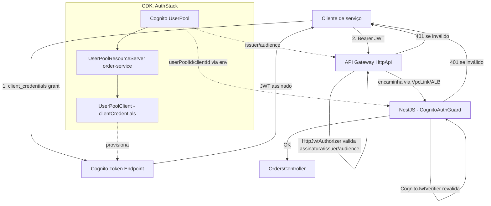

# Auth (Cognito M2M) Design

**Spec**: `.specs/features/auth/spec.md`
**Status**: Draft

---

## Architecture Overview

Autenticação M2M via Cognito, aplicada em 2 camadas independentes: o API Gateway rejeita antes de alcançar o ALB (usando o `HttpJwtAuthorizer` nativo, sem Lambda), e um guard global do NestJS revalida o mesmo JWT de forma independente. Um `AUTH_PROVIDER` env var (default `COGNITO`) permite desligar a camada 2 em dev/teste local, espelhando o padrão já usado por `PERSISTENCE_PROVIDER` (AD-002/AD-009).



**Abordagem escolhida (A):** guard global (`APP_GUARD`) + decorator `@Public()`, com Cognito provisionado em uma `AuthStack` própria. Rejeitada a alternativa de guard por-controller (fail-open por omissão em controllers futuros) e a de Lambda authorizer customizado (over-engineering para "só autenticado, sem scopes").

---

## Code Reuse Analysis

### Existing Components to Leverage

| Component | Location | How to Use |
| --- | --- | --- |
| Padrão de provider via env var + `useFactory` | `src/order/order.module.ts` (`PERSISTENCE_PROVIDER`) | Mesmo padrão para `AUTH_PROVIDER`: leitura no topo do módulo, `switch`/`default` lança erro em valor inválido |
| Padrão de módulo compartilhado sem domínio | `src/shared/http/health.module.ts` | Novo `src/shared/auth/auth.module.ts` segue a mesma convenção de módulo em `shared/` |
| Padrão de pinning de env var em e2e (`require()` do `AppModule` após setar env) | `test/orders.e2e-spec.ts:22-26`, `test/health.e2e-spec.ts:12-14` | e2e specs existentes ganham `process.env.AUTH_PROVIDER = 'NONE'` antes do `require('@/app.module')`, igual já fazem com `PERSISTENCE_PROVIDER` |
| `OrderExceptionFilter` (mapeamento de erro → HTTP) | `src/order/infrastructure/http/order-exception.filter.ts` | Não reutilizado diretamente (guard lança `UnauthorizedException` do Nest, que o filtro global de exceções do Nest já mapeia para 401 sem filtro customizado) |
| `EdgeStack.httpApi` / `serviceConfig.publicPath` | `infra/lib/edge-stack.ts`, `infra/lib/config.ts` | As rotas existentes (`{proxy+}` e path raiz de `/orders`) ganham `authorizer` no `addRoutes`; nenhuma rota nova é criada |
| `ComputeStack` — padrão de `environment`/`secrets` no container | `infra/lib/compute-stack.ts:86-92` | Novas entradas em `environment` (`AUTH_PROVIDER`, `COGNITO_USER_POOL_ID`, `COGNITO_CLIENT_ID`) seguem o mesmo objeto, sem novo secret (verificação de JWT não precisa de client secret) |
| `bin/app.ts` — grafo de dependências entre stacks | `infra/bin/app.ts` | Nova `AuthStack` entra sem depender de VPC/DB; `ComputeStack` e `EdgeStack` passam a depender dela |

### Integration Points

| System | Integration Method |
| --- | --- |
| Cognito Token Endpoint | Cliente de serviço externo troca `client_id`/`client_secret` por JWT via `grant_type=client_credentials` — fora do código deste repo, só a infra (App Client) é provisionada aqui |
| API Gateway (`EdgeStack`) | `HttpJwtAuthorizer` (`aws-apigatewayv2-authorizers`) anexado às rotas `/orders` e `/orders/{proxy+}` via `addRoutes({ authorizer })` |
| NestJS (`AppModule`) | Novo `AuthModule` global, guard registrado via `APP_GUARD` token |
| ECS Task Definition (`ComputeStack`) | Env vars `AUTH_PROVIDER`, `COGNITO_USER_POOL_ID`, `COGNITO_CLIENT_ID` adicionadas ao container existente |

---

## Components

### `AuthStack` (CDK)

- **Purpose**: Provisiona o Cognito User Pool M2M (sem hosted UI) — User Pool, Resource Server, App Client com `client_credentials`.
- **Location**: `infra/lib/auth-stack.ts`
- **Interfaces**:
  - `public readonly userPool: cognito.UserPool`
  - `public readonly userPoolClient: cognito.UserPoolClient`
  - `public readonly resourceServerIdentifier: string` — usado para montar o `jwtAudience` do authorizer
- **Dependencies**: nenhuma (sem VPC, sem DB — Cognito é regional/global, não vive na VPC)
- **Reuses**: convenção de `cdk.CfnOutput` para expor `userPoolId`/`userPoolClientId` (mesmo padrão de `FoundationStack`/`ComputeStack`)

Detalhe de implementação (não código final, orientação para Tasks):

```typescript
const userPool = new cognito.UserPool(this, 'UserPool', {
  userPoolName: `${serviceConfig.serviceName}-users`,
  removalPolicy: cdk.RemovalPolicy.RETAIN, // dados de auth não são descartáveis
});

const resourceServer = userPool.addResourceServer('ResourceServer', {
  identifier: 'order-service',
  // sem scopes: spec decide "só autenticado", sem granularidade de escopo
});

const userPoolClient = userPool.addClient('ServiceClient', {
  generateSecret: true,
  oAuth: {
    flows: { clientCredentials: true },
    scopes: [OAuthScope.resourceServer(resourceServer, /* scope curinga, ver Risco 1 */)],
  },
});
```

> **Risco identificado (ver Risks & Concerns):** `clientCredentials` exige ao menos 1 `OAuthScope.resourceServer(...)` — como não há diferenciação de escopo nesta fase, cria-se **um único scope "catch-all"** (ex. `order-service/access`) no Resource Server, concedido ao client. Isso é infraestrutura, não autorização — nenhuma verificação de escopo específico é feita no guard ou no authorizer (só existência de um JWT válido do client), preservando a decisão "só autenticado, sem diferenciação".

### `EdgeStack` (extensão)

- **Purpose**: Anexa o `HttpJwtAuthorizer` às rotas existentes de `/orders` e configura throttling na stage.
- **Location**: `infra/lib/edge-stack.ts` (arquivo existente, estendido)
- **Interfaces**: `EdgeStackProps` ganha `userPool: cognito.IUserPool` e `userPoolClientId: string`
- **Dependencies**: `AuthStack` (novo), `NetworkStack` (já existente)
- **Reuses**: `apigwv2.HttpApi.addRoutes` já usado — só adiciona `authorizer` às duas chamadas existentes (linhas 69-86 do arquivo atual)

Mudança de forma de criação da stage (para permitir throttle): `new apigwv2.HttpApi(this, 'HttpApi', { createDefaultStage: false })`, seguido de `httpApi.addStage('DefaultStage', { stageName: '$default', autoDeploy: true, throttle: { rateLimit, burstLimit } })`.

### `src/shared/auth/auth.module.ts`

- **Purpose**: Registra o guard de autenticação como `APP_GUARD` global, escolhido por `AUTH_PROVIDER`.
- **Location**: `src/shared/auth/auth.module.ts`
- **Interfaces**: `@Global() @Module({...})` — nenhuma API pública além do módulo em si
- **Dependencies**: `AUTH_PROVIDER` env var
- **Reuses**: padrão `useFactory` + `switch`/`default` de `order.module.ts:14-15,32-42`

```typescript
const provider = process.env.AUTH_PROVIDER ?? 'COGNITO';

@Global()
@Module({
  providers: [
    {
      provide: APP_GUARD,
      useFactory: () => {
        switch (provider) {
          case 'NONE':
            return new NoopAuthGuard();
          case 'COGNITO':
            return new CognitoAuthGuard(new Reflector());
          default:
            throw new Error(`Unsupported AUTH_PROVIDER: ${provider}`);
        }
      },
    },
  ],
})
export class AuthModule {}
```

### `src/shared/auth/cognito-auth.guard.ts`

- **Purpose**: Revalida o JWT (assinatura, issuer, audience, `token_use=access`) de forma independente do API Gateway; consulta `@Public()` via `Reflector` para pular rotas públicas.
- **Location**: `src/shared/auth/cognito-auth.guard.ts`
- **Interfaces**: `canActivate(context: ExecutionContext): Promise<boolean>` (contrato `CanActivate` do Nest)
- **Dependencies**: `aws-jwt-verify` (`CognitoJwtVerifier.create({ userPoolId, tokenUse: 'access', clientId })`), lê `COGNITO_USER_POOL_ID`/`COGNITO_CLIENT_ID` do ambiente
- **Reuses**: nada existente — é o primeiro guard do projeto
- **Efeito colateral (decisão do usuário nesta sessão):** após verificar o token com sucesso, o guard extrai o claim `client_id` do payload já validado e anexa em `request.authClientId`, disponível para qualquer controller/interceptor/log downstream sem reprocessar o JWT. Não é usado para autorização (mantém a decisão "só autenticado, sem diferenciação de permissões") — só identifica *quem* chamou, para observabilidade/rastreabilidade futura (alinhado à meta de rastreabilidade fim a fim do PRD).

### `src/shared/auth/noop-auth.guard.ts`

- **Purpose**: Guard trivial que sempre permite (`AUTH_PROVIDER=NONE`), usado em dev/teste local.
- **Location**: `src/shared/auth/noop-auth.guard.ts`
- **Interfaces**: `canActivate(): boolean { return true; }`
- **Dependencies**: nenhuma
- **Reuses**: nada

### `src/shared/auth/public.decorator.ts`

- **Purpose**: Marca rotas isentas de autenticação (`HealthController`).
- **Location**: `src/shared/auth/public.decorator.ts`
- **Interfaces**: `Public(): CustomDecorator` — `SetMetadata('isPublic', true)`
- **Dependencies**: `@nestjs/common` (`SetMetadata`, `Reflector`)
- **Reuses**: padrão nativo do Nest para decorators de metadata (não há precedente no projeto, mas é o padrão oficial documentado do framework)

---

## Data Models

Nenhum modelo de dado novo — Cognito gerencia seu próprio estado (User Pool, App Client), sem tabela/entidade no Postgres deste projeto. O único "dado" trafegado é o JWT em si, verificado em memória, nunca persistido.

---

## Error Handling Strategy

| Error Scenario | Handling | User Impact |
| --- | --- | --- |
| Sem header `Authorization` | API Gateway rejeita antes de chegar ao ALB (authorizer nativo) | 401, corpo padrão do API Gateway |
| Token expirado / assinatura inválida / issuer-audience incorretos (na borda) | `HttpJwtAuthorizer` rejeita | 401 |
| Token válido na borda, mas guard NestJS falha na revalidação (ex. `clientId` não bate, ou biblioteca detecta problema que o authorizer não pegou) | `CognitoAuthGuard` lança `UnauthorizedException`, filtro de exceções nativo do Nest responde | 401 |
| JWKS do Cognito inacessível (falha de rede) e cache vazio | `aws-jwt-verify` lança erro na chamada a `.verify()`; guard captura e relança como `UnauthorizedException` (fail closed) | 401 (nunca 500 silencioso aceitando o token) |
| `AUTH_PROVIDER` com valor inválido | `AuthModule`/`OrdersModule` lançam erro síncrono no boot (`useFactory`) | Aplicação não sobe — falha visível em CI/deploy, não em runtime |
| Throttling excedido (rate/burst) | API Gateway responde nativamente | 429, antes de alcançar ALB/ECS |

---

## Risks & Concerns

| Concern | Location (file:line) | Impact | Mitigation |
| --- | --- | --- | --- |
| `clientCredentials` do Cognito exige pelo menos 1 scope de Resource Server — não existe "sem scope" no App Client | `infra/lib/auth-stack.ts` (novo) | Sem esse scope catch-all, o CDK/CloudFormation rejeita a criação do App Client | Criar 1 `ResourceServerScope` genérico (ex. `access`) no Resource Server; nenhuma verificação de escopo específico no guard/authorizer — é infraestrutura obrigatória, não autorização granular (documentado no componente `AuthStack` acima) |
| `HttpApi` muda de `createDefaultStage` implícito para explícito, para permitir throttle | `infra/lib/edge-stack.ts:68` | Se a troca de `createDefaultStage`/`addStage` for feita errado, a URL do `HttpApiUrl` (CfnOutput) pode mudar ou quebrar o stage `$default` | Task de implementação deve rodar `cdk diff` e confirmar que `HttpApiUrl`/stage name permanecem `$default` antes de aplicar; testado via `cdk synth` limpo como gate (já é prática do projeto, `aws-deploy` Verifier) |
| Testes e2e existentes (`orders.e2e-spec.ts`, `orders-postgres.e2e-spec.ts`, `health.e2e-spec.ts`) hoje não setam `AUTH_PROVIDER` | `test/*.e2e-spec.ts` | Com o novo default `COGNITO`, esses specs tentariam validar JWT real e quebrariam sem token | Cada spec precisa ganhar `process.env.AUTH_PROVIDER = 'NONE'` antes do `require('@/app.module')`, no mesmo padrão já usado para `PERSISTENCE_PROVIDER` — vira uma task explícita de Tasks/Execute, não uma surpresa da Verifier |
| Nenhum teste de guard cobre o caminho `COGNITO` real hoje (não há User Pool em CI) | N/A (gap futuro) | O caminho `CognitoAuthGuard` fica sem cobertura automatizada de "token válido de verdade" | Task de teste unitário do guard usa um par de chaves RSA de teste + JWT assinado manualmente (mesma técnica usada por bibliotecas de teste de `aws-jwt-verify`), sem depender de Cognito real — cobre assinatura/issuer/audience/expiração via mock de JWKS endpoint |

> Nenhum outro risco de segurança, performance ou dívida técnica identificado nas áreas tocadas (rotas `/orders`, `EdgeStack`, módulos NestJS existentes) além dos listados acima.

---

## Tech Decisions (only non-obvious ones)

| Decision | Choice | Rationale |
| --- | --- | --- |
| Biblioteca de verificação de JWT no NestJS | `aws-jwt-verify` (pacote oficial AWS, `npm view` confirmou versão 5.2.1 publicada) | Cache de JWKS embutido (fail-closed nativo), API dedicada a Cognito (`CognitoJwtVerifier`), evita reimplementar verificação de assinatura/claims na mão |
| Onde o Cognito é provisionado no CDK | Nova `AuthStack`, sem depender de VPC/DB | Ciclo de vida independente de compute/rede (User Pool não vive na VPC); segue o precedente de AD-017 ("cria nova stack se o recurso não se encaixa no ciclo de vida de nenhuma existente") |
| Estratégia de guard | Global (`APP_GUARD`) + `@Public()` | Seguro por padrão — novo controller futuro nasce protegido; only opt-out explícito. Abordagem A escolhida pelo usuário nesta sessão |
| Scope catch-all no Resource Server | 1 scope técnico (`access`), sem uso para autorização | Requisito técnico inescapável do fluxo `client_credentials` do Cognito (não existe client sem nenhum scope), não uma reversão da decisão "sem granularidade de authz" |
| Throttling | `ThrottleSettings` (`rateLimit`/`burstLimit`) na `HttpStage` explícita, não WAF | PRD/spec só pedem "throttling básico"; WAF é explicitamente out-of-scope no spec |
| Exposição do `client_id` autenticado | Guard anexa `request.authClientId` após verificação, sem interceptor/decorator novo | Decisão explícita do usuário nesta sessão — menor superfície possível para disponibilizar "quem chamou" a consumidores futuros (logs, correlação), sem introduzir autorização por client |

> **Nota de decisão de projeto:** a escolha de `AuthStack` como nova stack (em vez de encaixar em uma das 5 existentes) estende o padrão de AD-017/AD-016 — será registrada em `.specs/STATE.md` como próxima `AD-NNN` ao final desta feature (Tasks/memory), não durante o Design.

---

## Tips

(referência interna do skill — não faz parte do artefato)
