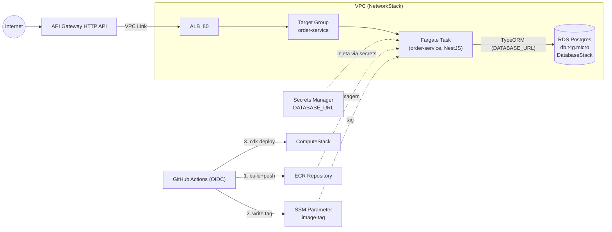

# AWS Deploy (Fase 0) Design

**Spec**: `.specs/features/aws-deploy/spec.md`
**Context**: `.specs/features/aws-deploy/context.md`
**Status**: Draft

---

## Architecture Overview

Adapta o padrão de `aws-reference.md` (ECS Fargate + ALB + API Gateway HTTP API + ECR/OIDC) ao fato de que este projeto é um **monólito modular** (AD do STATE.md linha 10) — nunca haverá N Fargate services atrás do mesmo ALB, só o processo único do `order-service`. Por decisão do usuário (approach exploration desta fase), as **6 stacks da referência são consolidadas em 5**, eliminando a abstração de "config genérica por N serviços" que a referência usa para plugar múltiplos microsserviços — sem caso de uso real aqui.

| # | Stack (este projeto) | Consolida (referência) | Depende de |
|---|---|---|---|
| 1 | `FoundationStack` | ECR + OIDC | — |
| 2 | `NetworkStack` | Rede (VPC) | — |
| 3 | `DatabaseStack` | RDS Postgres | Network |
| 4 | `ComputeStack` | Cluster ECS **+ Fargate Service** (Task Definition, Secrets Manager, health check) | Foundation, Network, Database |
| 5 | `EdgeStack` | Load Balancer **+ API Gateway + VPC Link** | Network, Compute |

RDS ganhou stack própria (`DatabaseStack`), separada da `NetworkStack` — decisão do usuário: mesmo o RDS sendo colocado dentro da VPC, deixá-lo dentro da própria `NetworkStack` escondia essa peça de infraestrutura em vez de deixá-la explícita como um componente de primeira classe do sistema. `DatabaseStack` depende de `NetworkStack` (recebe `vpc` e cria o security group de ingress do banco), mas é uma unidade de deploy/leitura separada. ALB e API Gateway continuam consolidados em `EdgeStack` porque com um único serviço não há "registrar N target groups" — é uma única integração ponta a ponta.



---

## Code Reuse Analysis

### Existing Components to Leverage

| Component | Location | How to Use |
| --- | --- | --- |
| `typeOrmDataSourceOptions` / `AppDataSource` | `src/order/infrastructure/persistence/typeorm/data-source.ts` | Já lê `DATABASE_URL` de env var e desliga `synchronize` (AD-003) — nenhuma mudança de app precisa disso, só a task definition precisa entregar `DATABASE_URL` via Secrets Manager em vez de `.env` local |
| `PERSISTENCE_PROVIDER` default `POSTGRES` | `OrdersModule` (AD-009) | Task definition simplesmente não define essa env var — usa o default já existente, conforme Edge Case da spec |
| Migration `1784043467617-init-order-schema.ts` | `src/order/infrastructure/persistence/typeorm/migrations/` | É a migration a aplicar manualmente no RDS antes do primeiro deploy (AC1.5) |
| `ci.yml` | `.github/workflows/ci.yml` | Ponto de partida para o novo workflow de deploy — reusa os mesmos jobs de lint/test como gate antes do job de build+push |
| `package.json` scripts (`build`, `test:e2e`) | raiz | Reusados no Dockerfile multi-stage e no workflow de CI, sem duplicar lógica de build |

### Integration Points

| System | Integration Method |
| --- | --- |
| RDS Postgres | `DATABASE_URL` montada pela `DatabaseStack` (endpoint do RDS) e gravada no Secrets Manager pela `ComputeStack`; a app lê via `data-source.ts` já existente, sem mudança de código |
| ECR / SSM | `ComputeStack` monta `ContainerImage.fromEcrRepository(repo, tag)` lendo a tag do SSM Parameter em tempo de synth, igual à referência |
| GitHub Actions OIDC | Duas IAM Roles na `FoundationStack` (push de imagem, deploy de IaC), assumidas via `aws-actions/configure-aws-credentials` com `role-to-assume`, sem access keys |

---

## Components

### `infra/` — projeto CDK (novo)

- **Purpose**: App CDK autocontido neste repositório (mono-repo, decisão do usuário em context.md), com as 5 stacks.
- **Location**: `infra/`, gerado via `cdk init app --language typescript` (não configuração escrita à mão) — `infra/bin/app.ts`, `infra/lib/*.ts`, `infra/package.json`, `infra/cdk.json` próprios, seguindo o layout padrão do CLI da CDK; dependências CDK não entram no `package.json` da aplicação NestJS
- **Interfaces**: `cdk deploy --all` (do zero), `cdk deploy <Stack>` (individual), `cdk diff`, `cdk destroy --all`
- **Dependências**: `aws-cdk-lib`, `constructs`, `aws-cdk` (CLI) — apenas em `infra/package.json`, geradas pelo `cdk init`
- **Reuses**: `cdk init app --language typescript` para o scaffold (template oficial do CLI); nenhuma stack de código de app é reaproveitada — as stacks só leem saídas (endpoint do RDS, ARN do repo ECR, nome do parâmetro SSM) entre si via CDK cross-stack references

### `FoundationStack`

- **Purpose**: Provisiona o que precisa existir antes de qualquer pipeline rodar — registro de imagem e identidade de deploy.
- **Location**: `infra/lib/foundation-stack.ts`
- **Interfaces** (recursos expostos para outras stacks via props/exports):
  - `repository: IRepository` — repositório ECR `order-service`, `imageTagMutability: IMMUTABLE`, `emptyOnDelete: true`, `removalPolicy: DESTROY`
  - `imageTagParameter: IStringParameter` — `/order-messaging-lab/order-service/image-tag`
- **Dependências**: OIDC Provider do GitHub já existente na conta (assumido, igual à referência); nenhuma dependência de outra stack
- **Reuses**: mesmo desenho de roles da referência (`github-actions-order-service-ecr-push`, `github-actions-cdk-deploy`), com `sub` restrito ao repo/branch `main` deste projeto (Assumption confirmada no spec)

### `NetworkStack`

- **Purpose**: VPC compartilhada por `DatabaseStack`, `ComputeStack` e `EdgeStack`.
- **Location**: `infra/lib/network-stack.ts`
- **Interfaces**:
  - `vpc: IVpc`
- **Dependências**: nenhuma
- **Reuses**: `maxAzs: 2` como a referência; **v1 mantém NAT Gateway padrão** (Assumption do spec, custo documentado como melhoria futura — não bloqueia o deploy)

### `DatabaseStack`

- **Purpose**: RDS Postgres gerenciado, isolado por security group — stack própria (decisão do usuário nesta revisão do Design) em vez de embutido na `NetworkStack`, para deixar o banco explícito como componente de primeira classe da infraestrutura.
- **Location**: `infra/lib/database-stack.ts`
- **Interfaces**:
  - `database: DatabaseInstance` — `db.t4g.micro`, engine Postgres, subnets privadas
  - `databaseSecurityGroup: ISecurityGroup` — ingress liberado só para o SG das tasks Fargate (referência cruzada via parâmetro, resolvida na `ComputeStack`)
- **Dependências**: `NetworkStack` (recebe `vpc` via props)
- **Reuses**: nenhuma peça da referência (RDS não faz parte do padrão original de `aws-reference.md` — é uma extensão deste projeto, já prevista no spec/context)

### `ComputeStack`

- **Purpose**: Cluster ECS + Fargate Service do `order-service`, lendo imagem do ECR/SSM e credencial do Secrets Manager.
- **Location**: `infra/lib/compute-stack.ts`
- **Interfaces**:
  - `cluster: ICluster`
  - `service: FargateService`
  - `targetGroup: ApplicationTargetGroup` — health check em `/health` (novo endpoint, ver componente abaixo)
- **Dependências**: `FoundationStack` (repo + parâmetro de tag), `NetworkStack` (vpc), `DatabaseStack` (endpoint do RDS, security group)
- **Reuses**: `circuitBreaker: { enable: true, rollback: true }`, `desiredCount` fixo (sem autoscaling, fora de escopo), `containerInsightsV2: ENABLED` — igual à referência
- **Novo em relação à referência**: cria o `Secret` do Secrets Manager com `DATABASE_URL` (montada a partir do endpoint do RDS + credenciais geradas), injetado via `secrets` da task definition (não `environment`) — a referência só demonstrava env vars simples

### `EdgeStack`

- **Purpose**: ALB (interno à VPC) + API Gateway HTTP API + VPC Link, expondo `/orders` publicamente.
- **Location**: `infra/lib/edge-stack.ts`
- **Interfaces**:
  - `loadBalancer: ApplicationLoadBalancer`
  - `httpApi: HttpApi` — output: URL pública (`https://{api-id}.execute-api.{region}.amazonaws.com`)
- **Dependências**: `ComputeStack` (target group), `NetworkStack` (vpc)
- **Reuses**: listener HTTP:80 com default action `404`, `HttpAlbIntegration` com `overwritePath` — igual à referência
- **Desvio da referência (mitigação de risco, ver Risks & Concerns)**: ALB criado como `internal: true` explicitamente (a referência deixa implícito/`internet-facing`) — este projeto quer garantir que o serviço só seja alcançável via API Gateway, ponto que a própria referência lista como débito técnico conhecido

### `HealthController` (app NestJS, novo)

- **Purpose**: Endpoint `GET /health` para o health check do target group do ALB — inexistente hoje no app (gap identificado durante o design, não coberto pela spec original nem pela referência, que só genericamente menciona "health check path do serviço").
- **Location**: `src/shared/http/health.controller.ts` (fora de qualquer subdomínio — não é lógica de negócio de `order`)
- **Interfaces**: `GET /health → 200 { status: 'ok' }` | `503` se a query de verificação ao Postgres falhar
- **Dependências**: `DataSource` do TypeORM (injeção via `@InjectDataSource()`), rodando `SELECT 1`
- **Reuses**: módulo TypeORM já configurado em `AppModule`; nenhuma dependência nova (não usa `@nestjs/terminus`, evita nova lib para um único endpoint)
- **Motivo de checar o Postgres**: a spec (Edge Cases) exige explicitamente que RDS indisponível reflita em falha de health check — um `/health` que sempre retorna `200` não cumpriria esse requisito

### `Dockerfile` (novo)

- **Purpose**: Build multi-stage da imagem de produção do `order-service`.
- **Location**: raiz do repo (`Dockerfile`)
- **Interfaces**: `ENTRYPOINT`/`CMD node dist/main`, expõe a porta lida de `PORT` (default `3000`, mesmo valor usado em `main.ts`)
- **Dependências**: `npm run build` (stage de build), `npm ci --omit=dev` (stage final)
- **Reuses**: scripts já existentes em `package.json` (`build`, `start:prod`)

### `.github/workflows/deploy.yml` (novo)

- **Purpose**: Pipeline de CI/CD do P2 — build+push de imagem via OIDC, seguido de `cdk deploy`.
- **Location**: `.github/workflows/deploy.yml`
- **Interfaces**: `on: push: branches: [main]`; dois jobs:
  1. `build-and-push` — assume a role de push (OIDC), `docker build`, push com tag = SHA do commit, `aws ssm put-parameter` na tag
  2. `deploy` (`needs: build-and-push`) — assume a role de deploy de IaC (OIDC), `cd infra && npx cdk deploy --all --require-approval never`
- **Dependências**: os dois `role-to-assume` ARNs (outputs da `FoundationStack`, configurados como GitHub Secrets/vars após o primeiro `cdk deploy --all` manual — bootstrap inicial não pode ser 100% automático, precisa existir a role antes do workflow poder usá-la)
- **Reuses**: mesmos steps de `npm ci`/lint/test já presentes em `ci.yml`, como gate antes do build de imagem (`needs`)

### Migration runbook (documentação, não código de app)

- **Purpose**: Procedimento documentado (README ou `infra/README.md`) para rodar `typeorm migration:run` contra o RDS antes do primeiro deploy da aplicação — decisão de context.md (agent discretion): one-off, não automático no boot.
- **Mecanismo escolhido**: `aws ecs run-task` usando a mesma task definition do `order-service`, mas com `overrideCommand` apontando para o script de migration (`npm run typeorm -- migration:run -d dist/order/infrastructure/persistence/typeorm/data-source.js`), rodando dentro da VPC/subnet privada (mesmo acesso de rede ao RDS que as tasks normais têm)
- **Por que não automatizar no pipeline**: evita corrida entre deploys concorrentes/múltiplas réplicas rodando migration ao mesmo tempo (mesmo risco que a spec já identifica); mantém controle manual explícito sobre quando uma migration roda em produção

---

## Data Models

Nenhum modelo de domínio novo. Modelos de configuração de infraestrutura:

```typescript
// infra/lib/config.ts — único ponto de verdade dos parâmetros do serviço
interface ServiceConfig {
  serviceName: 'order-service';
  containerPort: number; // 3000, mesmo default do main.ts
  publicPath: '/orders';
  healthCheckPath: '/health';
  cpu: number; // 512
  memoryLimitMiB: number; // 1024
  desiredCount: number; // 1 (ambiente único "dev", sem HA multi-AZ de réplicas — ver Assumptions do spec)
}
```

**Relationships**: consumido por `ComputeStack` (task definition, health check do target group) e por `EdgeStack` (path pattern da rota do API Gateway).

---

## Error Handling Strategy

| Error Scenario | Handling | User Impact |
| --- | --- | --- |
| RDS indisponível (provisionando/caído) | `/health` falha (`SELECT 1` lança) → `503` → target group marca task unhealthy → ALB para de rotear para ela | Cliente recebe erro de conectividade do API Gateway/ALB (nenhuma resposta da app), não um 500 de app |
| Migrations não aplicadas | Query real (`/orders`) falha com erro de tabela inexistente → `OrderExceptionFilter` não trata esse tipo de erro (não é `HttpException`) → Nest responde `500` genérico, logado no CloudWatch | Cliente recebe `500`; operador precisa checar CloudWatch Logs (comportamento já assumido pela spec, Edge Cases) |
| Deploy de nova imagem falha no health check | ECS `circuitBreaker` faz rollback automático para a task definition anterior | Nenhum downtime visível ao cliente; push fica "falho" no GitHub Actions só se o rollback também falhar |
| Rota pública não mapeada | ALB default action `404 Not Found` | Cliente recebe `404` puro do ALB, sem passar pela app |
| `DATABASE_URL` ausente/errada no Secrets Manager | App falha ao conectar no boot (TypeORM) → task nunca fica healthy → nunca entra no target group | Deploy trava no circuit breaker / rollback; nunca fica visível publicamente com config quebrada |

---

## Risks & Concerns

| Concern | Location (file:line) | Impact | Mitigation |
| --- | --- | --- | --- |
| Não existe endpoint de health check hoje | `src/order/infrastructure/http/orders.controller.ts` (só rotas de negócio) | ALB/target group não teria como saber se a task está saudável — reference architecture assume que cada serviço já expõe um health check path | Novo componente `HealthController` (`/health`, checa Postgres), ver seção Components |
| ALB da referência não define `internal: true` explicitamente | `aws-reference.md` (Segurança e rede — resumo), débito técnico conhecido do padrão original | Se replicado literalmente, o ALB seria tecnicamente alcançável da internet, contornando a API Gateway | `EdgeStack` cria o ALB com `internal: true` explícito, fechando esse gap já na v1 |
| `infra/` ainda não existe — CDK, Docker, workflow de deploy são 100% novos neste repo | N/A (greenfield dentro do projeto) | Maior superfície de risco de acerto de detalhe (permissões IAM, VPC, roteamento) do que uma extensão de código existente | Tasks vão sequenciar deploy incremental por stack, testável via `cdk synth`/`cdk diff` antes de `cdk deploy`; primeiro deploy real fica marcado como validação manual (Independent Test da spec), não coberto por teste automatizado de unidade |
| Bootstrap circular: workflow de deploy precisa dos ARNs de role que só existem depois do primeiro `cdk deploy` manual | `.github/workflows/deploy.yml` | Pipeline não funciona "do zero" sem um passo manual inicial | Documentado explicitamente no runbook: primeiro `cdk deploy --all` é sempre manual (credenciais locais do usuário), só deploys subsequentes usam o workflow automatizado |
| Migration one-off via `ecs run-task` depende de rodar manualmente antes do primeiro tráfego | Migration runbook | Se esquecido, `/orders` responde `500` (comportamento aceito pela spec) mas é um passo manual fácil de esquecer | Documentado no runbook como pré-requisito explícito do primeiro deploy; fora do escopo automatizar (decisão de context.md) |

---

## Tech Decisions (only non-obvious ones)

| Decision | Choice | Rationale |
| --- | --- | --- |
| Estrutura das stacks CDK | 5 stacks consolidadas (Foundation, Network, Database, Compute, Edge) em vez das 6 da referência | Decisão do usuário nesta fase de Design — mono-repo/monólito modular nunca terá N Fargate services, abstração genérica de "registrar serviço" da referência não tem caso de uso real aqui |
| Localização do RDS | `DatabaseStack` própria, dependente de `NetworkStack` | Decisão do usuário: deixar o banco embutido na `NetworkStack` escondia essa peça de infraestrutura; separar deixa o RDS explícito e deployável/lido de forma independente |
| Health check do target group | Novo endpoint `/health` checando Postgres (`SELECT 1`), sem `@nestjs/terminus` | Gap não coberto pela spec original; endpoint mínimo evita nova dependência só para 1 rota |
| Migration em produção | One-off manual via `ecs run-task`, fora do pipeline automático | Já decidido em context.md (agent discretion) — evita corrida entre réplicas se fosse automática no boot |
| ALB | `internal: true` explícito | Fecha um débito técnico que a própria referência documenta, sem custo adicional de implementação |

> **Project-level decision registrada**: a consolidação de 6→5 stacks (com `DatabaseStack` própria para o RDS) estabelece o padrão de IaC que as próximas fases (Fase 1: SNS/SQS/Redis; Fase 2: RabbitMQ) vão estender — registrada como AD-017 em `.specs/project/STATE.md`.

---

## Tips

(seção de referência do template, não aplicável ao conteúdo final)
