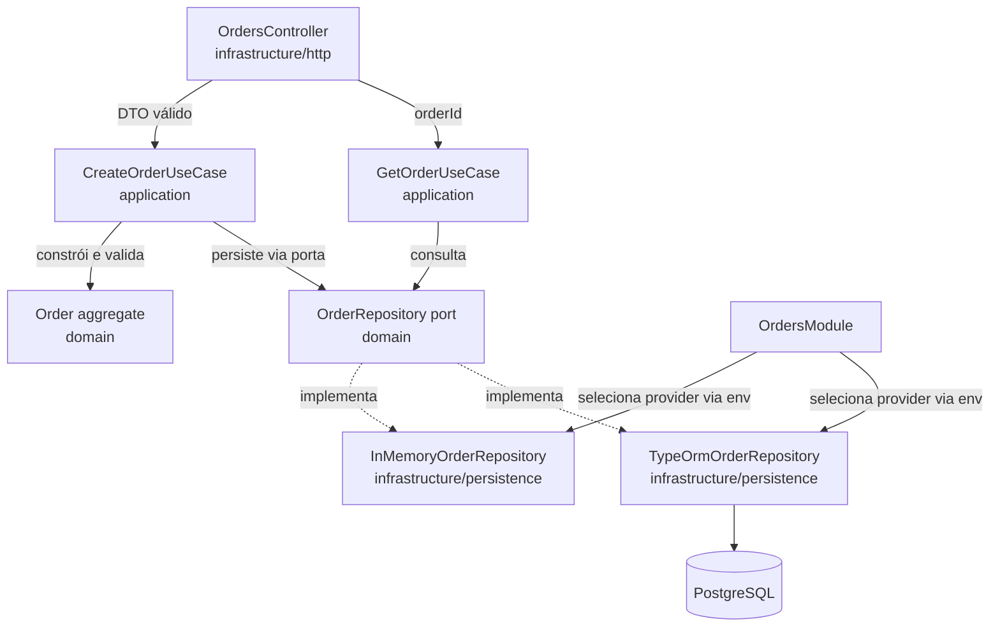

# Fase 0 — Fundação de Domínio + API de Criação de Pedido — Design

**Spec**: `.specs/features/fase0-fundacao-dominio/spec.md`
**Status**: Draft

---

## Architecture Overview

Arquitetura hexagonal (ports-and-adapters) aplicada a um único subdomínio (`order`), estruturado em três camadas com regra de dependência unidirecional: `infrastructure → application → domain`. `domain/` e `application/` nunca importam de `infrastructure/`, TypeORM, Express/Nest HTTP decorators ou qualquer SDK externo — a fronteira é validada por lint de arquitetura (`dependency-cruiser`) bloqueante em CI.



**Fluxo de escrita (`POST /orders`)**: Controller recebe `CreateOrderDto`, valida forma (class-validator) → chama `CreateOrderUseCase.execute()` → use case constrói `Order` (domínio valida invariantes, lança `DomainError` se inválido) → use case chama `OrderRepository.save()` → controller mapeia resultado para `201` ou erro de domínio para `400`.

**Fluxo de leitura (`GET /orders/:id`)**: Controller valida `id` como uuid (pipe) → `GetOrderUseCase.execute()` → `OrderRepository.findById()` → `404` se `null`, senão mapeia para response DTO.

---

## Code Reuse Analysis

### Existing Components to Leverage

| Component | Location | How to Use |
|---|---|---|
| `AppModule` | `src/app.module.ts` | Importa `OrdersModule` |
| Estrutura NestJS padrão (main.ts bootstrap) | `src/main.ts` | Adiciona `ValidationPipe` global e Swagger bootstrap |
| `eslint.config.mjs` | raiz | Mantido como está; lint de arquitetura roda como ferramenta separada (`dependency-cruiser`), não via ESLint boundaries — ver Tech Decisions |

Não há código de domínio pré-existente — subdomínio `order` é criado do zero, conforme decisão em STATE.md ("Fase 0 cria apenas o subdomínio `order` completo").

### Integration Points

| System | Integration Method |
|---|---|
| PostgreSQL | `TypeOrmOrderRepository` (adapter), ativado via `PERSISTENCE_PROVIDER=POSTGRES`; schema gerenciado por migration TypeORM (não `synchronize: true`) |
| In-memory store | `InMemoryOrderRepository` (adapter), default para dev/teste sem infra externa |
| CI | Novo step de lint de arquitetura no pipeline (arquivo de workflow fora do escopo desta spec de código — adicionado como task de config) |

---

## Components

### `domain/order/order.aggregate.ts` — `Order`

- **Purpose**: Entidade raiz do agregado; garante invariantes de criação e cálculo de total.
- **Location**: `src/order/domain/order.aggregate.ts`
- **Interfaces**:
  - `static create(props: { customerId: string; items: OrderItemProps[] }): Order` — factory; lança `EmptyOrderError` se `items` vazio; delega criação de cada `OrderItem` (que valida quantity/unitPrice); calcula `totalAmount: Money`.
  - `get orderId(): string`, `get customerId(): string`, `get items(): readonly OrderItem[]`, `get status(): OrderStatus`, `get totalAmount(): Money`, `get createdAt(): Date`
- **Dependencies**: `OrderItem`, `Money`, `OrderStatus`, gerador de uuid (via porta simples `IdGenerator` injetada na factory ou `crypto.randomUUID()` direto — ver Tech Decisions).
- **Reuses**: nada (novo).

### `domain/order/order-item.entity.ts` — `OrderItem`

- **Purpose**: Entidade filha do agregado, identidade própria (`orderItemId`), imutável após criação.
- **Location**: `src/order/domain/order-item.entity.ts`
- **Interfaces**:
  - `static create(props: { sku: string; quantity: number; unitPrice: number }): OrderItem` — lança `InvalidOrderItemError` se `sku` vazio/ausente, `quantity <= 0` ou `unitPrice < 0`.
  - `get orderItemId(): string`, `get sku(): string`, `get quantity(): number`, `get unitPrice(): Money`
- **Dependencies**: `Money`.
- **Reuses**: nada (novo).

### `domain/order/money.vo.ts` — `Money`

- **Purpose**: Value object monetário imutável; normaliza para 2 casas decimais com arredondamento bancário (half-to-even), nunca expõe `number` flutuante cru nas operações.
- **Location**: `src/order/domain/money.vo.ts`
- **Interfaces**:
  - `static fromNumber(value: number): Money`
  - `add(other: Money): Money`
  - `multiply(factor: number): Money` — usado para `unitPrice.multiply(quantity)`
  - `get amount(): number` (valor normalizado, só para serialização)
  - `equals(other: Money): boolean`
- **Dependencies**: nenhuma.
- **Reuses**: nada (novo). Implementação em inteiro de centavos internamente para evitar erro de ponto flutuante.

### `domain/order/order-status.vo.ts` — `OrderStatus`

- **Purpose**: Value object de status; nesta fase só o valor `CREATED` é produzido (enum pronto para os estados futuros da Fase 1: `PAYMENT_PENDING`, `CONFIRMED`, `REJECTED` etc., mas não implementados agora).
- **Location**: `src/order/domain/order-status.vo.ts`
- **Interfaces**: `enum OrderStatus { CREATED = 'CREATED' }`
- **Dependencies**: nenhuma.
- **Reuses**: nada (novo).

### `domain/order/errors/`

- **Purpose**: Erros de domínio puros (não HTTP): `EmptyOrderError`, `InvalidOrderItemError`, extends `DomainError` base.
- **Location**: `src/order/domain/errors/domain-error.ts`, `empty-order.error.ts`, `invalid-order-item.error.ts`
- **Interfaces**: `class DomainError extends Error`
- **Dependencies**: nenhuma.

### `domain/order/order-repository.port.ts` — `OrderRepository`

- **Purpose**: Porta de persistência (interface), definida no domínio, implementada na infraestrutura.
- **Location**: `src/order/domain/order-repository.port.ts`
- **Interfaces**:
  - `save(order: Order): Promise<void>`
  - `findById(orderId: string): Promise<Order | null>`
- **Dependencies**: `Order`.

### `application/create-order.use-case.ts` — `CreateOrderUseCase`

- **Purpose**: Orquestra criação: constrói `Order` via domínio, persiste via porta.
- **Location**: `src/order/application/create-order.use-case.ts`
- **Interfaces**: `execute(input: { customerId: string; items: {sku, quantity, unitPrice}[] }): Promise<Order>`
- **Dependencies**: `OrderRepository` (injetado via token, `@Inject(ORDER_REPOSITORY)`).
- **Reuses**: `Order.create`.

### `application/get-order.use-case.ts` — `GetOrderUseCase`

- **Purpose**: Busca pedido por id.
- **Location**: `src/order/application/get-order.use-case.ts`
- **Interfaces**: `execute(orderId: string): Promise<Order | null>`
- **Dependencies**: `OrderRepository`.

### `infrastructure/http/orders.controller.ts` — `OrdersController`

- **Purpose**: Adapter HTTP; mapeia DTOs ↔ chamadas de use case; traduz erros de domínio para HTTP.
- **Location**: `src/order/infrastructure/http/orders.controller.ts`
- **Interfaces**:
  - `POST /orders` → `create(dto: CreateOrderDto): Promise<OrderResponseDto>` (201)
  - `GET /orders/:id` → `findById(@Param('id', ParseUUIDPipe) id: string): Promise<OrderResponseDto>` (200/404)
- **Dependencies**: `CreateOrderUseCase`, `GetOrderUseCase`, `OrderExceptionFilter` (mapeia `DomainError` → 400, not-found → 404, erro inesperado → 500 sem detalhes internos).
- **Reuses**: `ValidationPipe` global do Nest (via `class-validator` nos DTOs), `ParseUUIDPipe` nativo do Nest para `ORD1-04`/`ORD1-03` (id inválido → 400).

### `infrastructure/http/dto/create-order.dto.ts`, `order-response.dto.ts`

- **Purpose**: Contratos de request/response; `class-validator` decorators para validação de forma (400 antes mesmo de chegar ao domínio, cobre `ORD1-02`, `ORD1-04`, edge case de `sku` vazio).
- **Location**: `src/order/infrastructure/http/dto/`
- **Dependencies**: `class-validator`, `class-transformer`, `@nestjs/swagger` (decorators `@ApiProperty` para P3).

### `infrastructure/persistence/in-memory-order.repository.ts` — `InMemoryOrderRepository`

- **Purpose**: Implementação `OrderRepository` em `Map<string, Order>`, default para dev/teste.
- **Location**: `src/order/infrastructure/persistence/in-memory-order.repository.ts`
- **Interfaces**: implementa `OrderRepository`.
- **Dependencies**: nenhuma externa.

### `infrastructure/persistence/typeorm/`

- **Purpose**: Implementação `OrderRepository` sobre Postgres via TypeORM; inclui `OrderEntity`/`OrderItemEntity` (schema ORM, separado do agregado de domínio) e mapper bidirecional domínio ↔ entidade ORM.
- **Location**: `src/order/infrastructure/persistence/typeorm/order.entity.ts`, `order-item.entity.ts`, `typeorm-order.repository.ts`, `order.mapper.ts`, `migrations/`
- **Interfaces**: implementa `OrderRepository`.
- **Dependencies**: `typeorm`, `@nestjs/typeorm`, `pg`.
- **Reuses**: mesmo contrato `OrderRepository` do adapter in-memory — troca é só de binding no módulo Nest.

### `infrastructure/order.module.ts` — `OrdersModule`

- **Purpose**: Wiring Nest — registra controller, use cases, e faz bind do token `ORDER_REPOSITORY` para `InMemoryOrderRepository` ou `TypeOrmOrderRepository` conforme `PERSISTENCE_PROVIDER`.
- **Location**: `src/order/order.module.ts`
- **Dependencies**: `ConfigModule` (ou `process.env` direto, dado o escopo pequeno).

### Architecture lint config

- **Purpose**: Bloquear imports proibidos (`domain/`, `application/` → `infrastructure/`, `typeorm`, `@nestjs/typeorm`, SDKs de mensageria).
- **Location**: `.dependency-cruiser.js` (raiz), script `npm run lint:arch` em `package.json`.
- **Reuses**: nenhuma ferramenta pré-existente no projeto — nova dependência dev (`dependency-cruiser`).

---

## Data Models

### Domínio — `Order` (aggregate, in-memory shape)

```typescript
interface Order {
  orderId: string; // uuid
  customerId: string; // uuid
  items: OrderItem[];
  status: OrderStatus; // 'CREATED'
  totalAmount: Money; // { amount: number (2 casas) }
  createdAt: Date;
}

interface OrderItem {
  orderItemId: string; // uuid
  sku: string;
  quantity: number;
  unitPrice: Money;
}
```

**Relationships**: `Order` 1—N `OrderItem` (composição; `OrderItem` não existe fora de um `Order`).

### Persistência Postgres — schema (TypeORM)

```typescript
// order.entity.ts
@Entity('orders')
class OrderEntity {
  @PrimaryColumn('uuid') orderId: string;
  @Column('uuid') customerId: string;
  @Column({ type: 'varchar' }) status: string;
  @Column('numeric', { precision: 12, scale: 2 }) totalAmount: string; // numeric como string p/ evitar perda de precisão
  @Column('timestamptz') createdAt: Date;
  @OneToMany(() => OrderItemEntity, (i) => i.order, { cascade: true, eager: true })
  items: OrderItemEntity[];
}

// order-item.entity.ts
@Entity('order_items')
class OrderItemEntity {
  @PrimaryColumn('uuid') orderItemId: string;
  @Column('uuid') orderId: string;
  @Column('varchar') sku: string;
  @Column('int') quantity: number;
  @Column('numeric', { precision: 12, scale: 2 }) unitPrice: string;
  @ManyToOne(() => OrderEntity, (o) => o.items) order: OrderEntity;
}
```

**Relationships**: `orders` 1—N `order_items` (FK `orderId`, `ON DELETE CASCADE`). Mapper converte `numeric` (string) ↔ `Money` (centavos internos) nos dois sentidos — nunca expõe `numeric` cru ao domínio.

---

## Error Handling Strategy

| Error Scenario | Handling | User Impact |
|---|---|---|
| `items` vazio ou ausente | `class-validator` (`@ArrayNotEmpty`) barra antes do use case | 400 com mensagem de validação |
| Item com `quantity <= 0` / `unitPrice < 0` / `sku` vazio | `class-validator` nos DTOs (`@IsPositive`, `@Min(0)`, `@IsNotEmpty`) barra a maioria; domínio (`OrderItem.create`) é a barreira final caso algo escape do DTO | 400 |
| `customerId` ausente/não-uuid | `class-validator` (`@IsUUID`) no DTO | 400 |
| `Order` construído sem itens (chamando domínio diretamente, ex. em teste) | `EmptyOrderError` (domain error) | N/A em teste unitário; se propagar via use case, filtro mapeia para 400 |
| `GET /orders/:id` com id não-uuid | `ParseUUIDPipe` do Nest | 400 |
| `GET /orders/:id` com id inexistente | `GetOrderUseCase` retorna `null` → controller lança `NotFoundException` | 404 |
| Falha inesperada de persistência (ex. Postgres indisponível) | Exception filter genérico (`OrderExceptionFilter` ou filtro global do Nest) captura, loga stack internamente, responde corpo genérico | 500 sem detalhes internos no corpo |
| Corpo do `POST /orders` não é JSON válido | Comportamento padrão do body parser do Nest/Express | 400 (sem tratamento customizado, conforme edge case do spec) |

---

## Risks & Concerns

| Concern | Location (file:line) | Impact | Mitigation |
|---|---|---|---|
| `synchronize: true` do TypeORM em dev pode mascarar migrations quebradas quando Postgres entrar em CI | `infrastructure/persistence/typeorm/*` (novo) | Schema drift não detectado até produção | Usar migration explícita (`typeorm migration:generate`/`run`) desde o início, nunca `synchronize: true`, mesmo em dev — task dedicada em Tasks |
| Duplo modelo de `OrderItem` (domínio vs `OrderItemEntity` do TypeORM) exige mapper mantido manualmente em sincronia | `infrastructure/persistence/typeorm/order.mapper.ts` (novo) | Bug silencioso se um campo novo for esquecido no mapper | Teste de integração do adapter Postgres (P2) cobre round-trip completo save→findById comparando campo a campo |
| `Money` como VO com aritmética de ponto flutuante é fonte clássica de bug de precisão | `domain/order/money.vo.ts` (novo) | Total calculado incorretamente em centavos | Implementar `Money` internamente em inteiro de centavos (não float), arredondamento bancário só na normalização de entrada, testado com casos de borda (ex. `0.1 + 0.2`) |
| Nenhum código de domínio pré-existente para reaproveitar — todo o subdomínio nasce nesta fase | N/A | Superfície de teste grande para atingir 80% de cobertura | Escopo de domínio é pequeno e coeso (4 classes); testes unitários diretos sem mocks cobrem naturalmente a maior parte |

> Nenhum risco de segurança identificado (sem auth nesta fase, conforme Out of Scope do spec).

---

## Tech Decisions (only non-obvious ones)

| Decision | Choice | Rationale |
|---|---|---|
| Ferramenta de lint de arquitetura | `dependency-cruiser` (não ESLint boundaries plugin) | STATE.md e PROJECT.md já apontam `dependency-cruiser` como opção primária; runs standalone via CLI, fácil de rodar como step de CI isolado do lint de estilo, mensagem de violação mais clara para import proibido de camada |
| Representação interna de `Money` | Inteiro de centavos (`number` inteiro, não `Decimal`/`bignumber.js`) | Evita dependência nova só para isso; domínio nunca lida com valores fora da faixa segura de inteiro JS nesta escala (pedidos de e-commerce); documentar limite se necessário no futuro |
| Geração de `orderId`/`orderItemId` | `crypto.randomUUID()` (nativo Node ≥ 14.17) chamado direto nas factories do domínio, sem porta `IdGenerator` injetável | Introduzir uma porta de infraestrutura só para geração de uuid seria over-engineering para o escopo desta fase; `crypto` é built-in do Node, não é um "SDK de infraestrutura" no sentido que o lint de arquitetura precisa bloquear (não é IO, não é rede/banco) |
| Persistência do `totalAmount` em Postgres | `numeric(12,2)` armazenado/lido como string, convertido para `Money` (centavos) no mapper | `numeric` do Postgres não deve ser lido como JS `number` (perda de precisão); TypeORM retorna `numeric` como string por padrão — mapper já assume isso |
| Seleção de provider de persistência | Variável de ambiente `PERSISTENCE_PROVIDER` (`IN_MEMORY` \| `POSTGRES`), lida em `OrdersModule` com `useFactory` | Nome e mecanismo já usados como termo de referência em PROJECT.md/STATE.md (`MESSAGING_PROVIDER` é o padrão análogo previsto para Fase 2); `IN_MEMORY` como default quando env ausente, para não exigir Docker em dev/teste padrão |
| DTOs de request/response separados das entidades de domínio | Sim — nunca serializar `Order`/`OrderItem` diretamente | Mantém domínio livre de decorators de infraestrutura (`class-validator`, `@ApiProperty` são metadata de borda, não pertencem ao domínio) |

> **Project-level decisions candidatas a AD-NNN**: a escolha de `dependency-cruiser` como ferramenta concreta (STATE.md já registrava a decisão de *ter* lint bloqueante, mas não a ferramenta) e o padrão `PERSISTENCE_PROVIDER` como nome de env var serão propostas para `STATE.md` após confirmação do usuário deste design (ver próximo passo).

---

## Requirement Traceability (atualização)

| Requirement ID | Componente(s) principal(is) |
|---|---|
| ORD0-01 | `CreateOrderUseCase`, `Order.create`, `OrdersController.create` |
| ORD0-02 | `CreateOrderDto` (class-validator), `OrderExceptionFilter` |
| ORD0-03 | `GetOrderUseCase`, `OrdersController.findById` |
| ORD0-04 | `Order`, `OrderItem`, `Money`, `OrderStatus` |
| ORD0-05 | `TypeOrmOrderRepository`, `OrderEntity`, `OrderItemEntity`, `order.mapper.ts` |
| ORD0-06 | `.dependency-cruiser.js`, step de CI |
| ORD0-07 | `@nestjs/swagger` decorators nos DTOs, bootstrap em `main.ts` |
