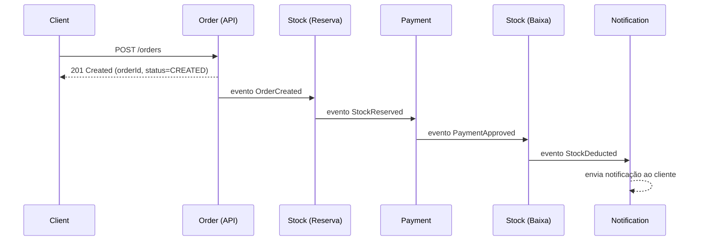
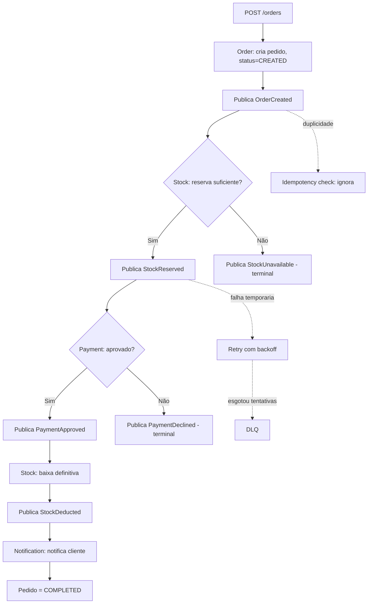
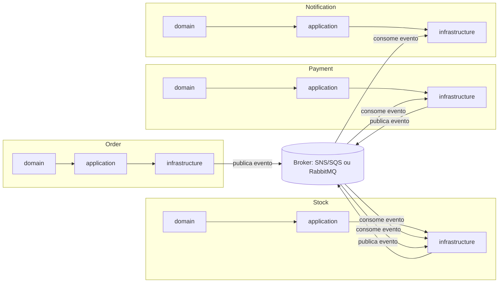

# PRD — order-messaging-lab

**Versão:** 0.2
**Autor:** PM/Arquitetura (gerado para kickoff técnico)
**Status:** Aprovado
**Última atualização:** 2026-07-20 — sincronizado com decisões já registradas em `.specs/project/STATE.md` e `.specs/project/ROADMAP.md` (nova fase de Autenticação, decisões pendentes resolvidas, perguntas em aberto respondidas). Para status/datas de execução atualizados, `ROADMAP.md` é a fonte viva; este documento registra o requisito.

---

## 1. Resumo Executivo

### 1.1 Visão do produto/lab

`order-messaging-lab` é um laboratório de engenharia que implementa, de ponta a ponta, um fluxo de **processamento de pedidos orientado a eventos**, usando **coreografia** (sem orquestrador central) sobre uma arquitetura **hexagonal (ports-and-adapters)** em **NestJS + TypeScript**.

O projeto não é um produto comercial: é um ambiente controlado para validar decisões arquiteturais que aparecem em sistemas reais de e-commerce/marketplace — consistência eventual, idempotência, contratos de evento versionados, troca de broker de mensageria sem reescrever regras de domínio, observabilidade fim a fim e resiliência a falhas (retry, DLQ, timeout).

O lab evolui em 4 fases incrementais, cada uma entregando um sistema funcional e testável:

- **Fase 0** — fundação de domínio + API síncrona de criação de pedido (sem mensageria ainda).
- **Fase 1** — autenticação machine-to-machine via AWS Cognito (`client_credentials`), em defesa em profundidade (API Gateway + guard NestJS), sem autorização por escopo. Inserida entre a fundação de domínio e a mensageria — decisão do usuário registrada em `.specs/features/auth/spec.md`.
- **Fase 2** — fluxo assíncrono completo via SNS/SQS.
- **Fase 3** — RabbitMQ como adapter alternativo/intercambiável, provando o isolamento do domínio em relação à tecnologia de mensageria.

### 1.2 Problema que o projeto resolve

Times que adotam arquitetura orientada a eventos frequentemente cometem os mesmos erros: domínio contaminado por detalhes de infraestrutura de mensageria, ausência de idempotência (processamento duplicado gera efeitos colaterais), contratos de evento sem versionamento (quebras silenciosas entre consumidores), falta de rastreabilidade fim a fim (impossível depurar um fluxo distribuído), e acoplamento ao broker específico (troca de tecnologia exige reescrever regras de negócio).

`order-messaging-lab` existe para provar, na prática, um conjunto de padrões que evitam esses problemas — e para servir como referência replicável para outros projetos do time.

### 1.3 Objetivo de aprendizado técnico e validação arquitetural

- Validar que a arquitetura hexagonal realmente isola o domínio de decisões de infraestrutura (mensageria, persistência, broker).
- Validar que a coreografia por eventos é sustentável sem orquestrador central até um certo nível de complexidade, e identificar em que ponto essa premissa quebra.
- Validar estratégias de idempotência, retry/backoff, DLQ e consistência eventual em um fluxo de múltiplos subdomínios.
- Validar a portabilidade do adapter de mensageria (SNS/SQS → RabbitMQ) sem alteração de regras de domínio ou de casos de uso.
- Produzir uma base de código de referência (contratos, testes, documentação) reutilizável para outros laboratórios/projetos.

---

## 2. Objetivos e Não Objetivos

### 2.1 Objetivos por fase

| Fase | Objetivo de negócio (simulado) | Objetivo técnico |
|---|---|---|
| Fase 0 | Permitir criação de pedido com resposta imediata ao cliente | Estabelecer domínio (entities, value objects, casos de uso), portas (ports) e primeiro adapter HTTP; sem mensageria |
| Fase 1 | Garantir que só clientes de serviço autorizados criem/consultem pedidos | Emissão/validação de JWT via AWS Cognito M2M, revalidado em 2 camadas (API Gateway + guard NestJS); sem autorização por escopo |
| Fase 2 | Processar pedido de forma assíncrona e resiliente, com etapas independentes (estoque, pagamento, notificação) | Implementar coreografia via SNS/SQS; publishers/consumers desacoplados; idempotência; DLQ; observabilidade |
| Fase 3 | Garantir que a solução não fique refém de um único fornecedor de mensageria (portabilidade) | Implementar adapter RabbitMQ intercambiável via porta `MessagePublisher`/`MessageConsumer`, sem tocar em domínio ou casos de uso |

### 2.2 Não objetivos (explícitos)

- **Fluxos avançados de compensação (Saga completa com rollback automático)** estão **fora de escopo** nas Fases 0–2. O lab cobre apenas o caminho feliz e um subconjunto de exceções (recusa de pagamento, falta de estoque) como *eventos de fim de fluxo*, sem orquestrar estornos automáticos.
- Não haverá interface de usuário (frontend). Toda interação é via API/eventos.
- Não haverá multi-tenancy, autenticação de usuário final completa (login, cadastro) — apenas autenticação de serviço machine-to-machine via JWT (AWS Cognito, `client_credentials`), implementada na Fase 1 (ver `.specs/features/auth/spec.md`); a alternativa de API Key foi descartada nessa decisão.
- Não haverá integração com gateways de pagamento reais — o subdomínio Payment será **simulado** (mock determinístico ou probabilístico configurável).
- Não haverá deploy em produção real nem SLA comercial — métricas de NFR são alvos de laboratório, não compromissos contratuais.
- Não haverá suporte a múltiplos brokers simultâneos em produção (o objetivo da Fase 2 é intercambiabilidade, não coexistência).
- Cancelamento de pedido, liberação de reserva de estoque e reprocessamento manual de DLQ via UI estão no **Backlog Futuro** (seção 11), fora do escopo imediato.

---

## 3. Escopo Funcional por Fase

### 3.1 Fase 0 — Fundação de domínio + API de criação de pedido

| Entregável | Descrição | Valor | Dependências | Prioridade |
|---|---|---|---|---|
| Modelagem de domínio `Order` | Entity `Order` (raiz do agregado), entidade filha `OrderItem` (identidade própria dentro do agregado — necessária para rastrear reserva por linha, ver Backlog Futuro §11), value objects (`Money`, `OrderStatus`), invariantes de negócio (pedido não pode ser criado sem itens, valor total > 0) | Base para todas as fases seguintes | Nenhuma | Must |
| Caso de uso `CreateOrder` | Caso de uso que valida, persiste e retorna o pedido criado; ponto único de entrada para criação | Garante regra de negócio centralizada, independente de transporte | Modelagem de domínio | Must |
| Porta `OrderRepository` | Interface de persistência definida no domínio, implementada por adapter (in-memory ou Postgres) | Permite trocar persistência sem tocar domínio | Modelagem de domínio | Must |
| Adapter HTTP `POST /orders` | Controller NestJS expondo a criação de pedido, com validação de payload (DTO + class-validator) | Ponto de entrada síncrono para o cliente | Caso de uso `CreateOrder` | Must |
| Adapter de persistência (in-memory) | Implementação simples do `OrderRepository` para viabilizar testes e execução local sem infraestrutura externa | Desbloqueia desenvolvimento sem dependências externas | Porta `OrderRepository` | Must |
| Adapter de persistência (Postgres) | Implementação real via TypeORM/Prisma | Aproxima o lab de um cenário realista | Adapter in-memory (como fallback) | Should |
| Estrutura de módulos por subdomínio | Pastas/módulos separados para `order`, `payment`, `stock`, `notification`, cada um com `domain`, `application`, `infrastructure` | Estabelece o padrão hexagonal replicável nas fases seguintes | Nenhuma | Must |
| Testes unitários do domínio `Order` | Cobertura das invariantes e do caso de uso `CreateOrder` | Garante confiabilidade da base antes de acoplar mensageria | Modelagem de domínio, caso de uso | Must |
| Documentação de contrato da API (OpenAPI) | Especificação do `POST /orders` (request/response/erros) | Contrato claro para consumidores da API | Adapter HTTP | Should |

**Critério de saída da Fase 0:** `POST /orders` cria um pedido válido, persiste e retorna 201 com o recurso criado, com testes unitários passando e sem nenhuma dependência de mensageria.

### 3.2 Fase 1 — Autenticação machine-to-machine (Cognito)

Especificação completa (goals, user stories, acceptance criteria, edge cases) em `.specs/features/auth/spec.md`. Resumo:

| Entregável | Descrição | Valor | Dependências | Prioridade |
|---|---|---|---|---|
| `AuthStack` (CDK) | User Pool Cognito + Resource Server + App Client + domínio hospedado (`/oauth2/token`) | Emissor de token M2M | Nenhuma (stack independente) | Must |
| Authorizer JWT no API Gateway | `HttpJwtAuthorizer` nativo apontando para o User Pool, aplicado às rotas de `orders` | Camada 1 de defesa em profundidade | `AuthStack` | Must |
| Guard `CognitoAuthGuard` (NestJS) | Revalida assinatura/issuer/audience do JWT, independente do API Gateway; `@Public()` como opt-out por rota (`APP_GUARD` global) | Camada 2 de defesa em profundidade | `AuthStack` | Must |
| `AUTH_PROVIDER` (`COGNITO` \| `NONE`) | Alterna guard real vs. no-op; default `COGNITO` (seguro por padrão) | Dev/teste local sem depender de Cognito real | Guard NestJS | Must |
| Throttling básico na borda | Rate/burst nativo do HTTP API nas rotas de `orders`, 429 acima do limite | Complementa defesa em profundidade (PRD §5.4) | `AuthStack`, API Gateway | Should |

**Fora de escopo desta fase (registrado em `.specs/features/auth/spec.md`):** autorização por escopo/permissão (`orders.read` vs `orders.write`) — só existe "autenticado ou não"; login de usuário final; múltiplos App Clients; rotação automática de client secret; rate limiting avançado (WAF, por client).

**Critério de saída da Fase 1:** `POST /orders` e `GET /orders/:id` rejeitam com 401 toda chamada sem JWT válido do Cognito em ambas as camadas; suíte de testes local roda sem depender de Cognito real (`AUTH_PROVIDER=NONE`); throttling configurado na borda.

**Status:** ✅ Concluída — ver `.specs/features/auth/validation.md` e `ROADMAP.md`.

### 3.3 Fase 2 — Mensageria com SNS/SQS e fluxo assíncrono completo

| Entregável | Descrição | Valor | Dependências | Prioridade |
|---|---|---|---|---|
| Portas `MessagePublisher` / `MessageConsumer` | Interfaces de domínio/aplicação para publicar e consumir eventos, agnósticas de broker | Base da portabilidade exigida na Fase 2 | Fase 0 completa | Must |
| Adapter SNS (publisher) | Implementação concreta que publica em tópicos SNS | Habilita publicação real de eventos | Portas de mensageria | Must |
| Adapter SQS (consumer) | Implementação concreta que consome filas SQS (via polling ou `@nestjs/microservices` custom transport) | Habilita consumo real de eventos | Portas de mensageria | Must |
| Contrato de evento `OrderCreated` v1 | Schema versionado (JSON Schema ou class-based) com payload e metadados | Contrato estável entre Order → Stock | Modelagem de domínio Order | Must |
| Subdomínio `Stock` — reserva | Caso de uso `ReserveStock`, consumindo `OrderCreated`, publicando `StockReserved` | Primeira etapa do fluxo assíncrono | Adapter SQS consumer, contrato `OrderCreated` | Must |
| Subdomínio `Payment` — processamento | Caso de uso `ProcessPayment`, consumindo `StockReserved`, publicando `PaymentApproved` (ou evento de recusa) | Simula gateway de pagamento | Subdomínio Stock (reserva) | Must |
| Subdomínio `Stock` — baixa definitiva | Caso de uso `DeductStock`, consumindo `PaymentApproved`, publicando `StockDeducted` | Fecha o ciclo de estoque | Subdomínio Payment | Must |
| Subdomínio `Notification` | Caso de uso `NotifyCustomer`, consumindo `StockDeducted` | Fecha o fluxo com feedback ao cliente | Subdomínio Stock (baixa) | Must |
| Idempotência por `idempotencyKey` | Tabela/estrutura de deduplicação (`processed_events`) por consumidor | Evita efeitos colaterais em reprocessamento/duplicidade | Todos os consumidores | Must |
| Retry com backoff exponencial | Configuração de redrive policy no SQS + tratamento de erro transitório na aplicação | Resiliência a falhas temporárias | Adapters SQS | Must |
| Dead Letter Queue (DLQ) por fila | Configuração de DLQ para cada fila SQS, com política de máximo de tentativas | Evita perda de mensagens e permite investigação | Adapters SQS | Must |
| Propagação de `correlationId`/`traceId` | Metadados obrigatórios em todo evento, propagados em toda a cadeia | Rastreabilidade fim a fim | Contratos de evento | Must |
| Observabilidade (logs estruturados + métricas básicas) | Logs em JSON com correlationId, métricas de latência/erro por etapa | Necessário para depurar fluxo distribuído | Propagação de correlationId | Should |
| Testes de integração (LocalStack) | Simulação de SNS/SQS local para testes automatizados do fluxo | Confiabilidade sem depender de AWS real | Adapters SNS/SQS | Must |
| Testes de contrato de evento | Validação de schema de cada evento publicado/consumido | Evita quebras silenciosas de contrato | Contratos de evento | Should |

**Critério de saída da Fase 2:** um pedido criado via `POST /orders` percorre todo o fluxo (reserva → pagamento → baixa → notificação) de forma assíncrona, com idempotência comprovada em teste de duplicidade e DLQ funcional em teste de falha permanente.

### 3.4 Fase 3 — RabbitMQ como adapter intercambiável

| Entregável | Descrição | Valor | Dependências | Prioridade |
|---|---|---|---|---|
| Adapter RabbitMQ (publisher) | Implementação de `MessagePublisher` usando exchanges/routing keys do RabbitMQ | Prova de portabilidade da porta de publicação | Fase 1 completa, portas estáveis | Must |
| Adapter RabbitMQ (consumer) | Implementação de `MessageConsumer` usando filas/bindings do RabbitMQ | Prova de portabilidade da porta de consumo | Portas estáveis | Must |
| Mapeamento de conceitos SNS/SQS → RabbitMQ | Documento de equivalência: tópico→exchange, fila→queue, redrive policy→dead-letter-exchange | Base de decisão para o mapeamento de contratos | Adapter RabbitMQ | Must |
| Configuração via variável de ambiente/flag | Mecanismo de seleção do broker ativo (`MESSAGING_PROVIDER=SNS_SQS \| RABBITMQ`) sem recompilar domínio/aplicação | Demonstra intercambiabilidade em tempo de configuração | Adapters RabbitMQ e SNS/SQS coexistindo | Must |
| Suite de testes de contrato duplicada (RabbitMQ) | Mesmos testes de contrato de evento da Fase 1, agora rodando contra RabbitMQ (via Testcontainers) | Garante paridade de comportamento entre brokers | Adapter RabbitMQ | Must |
| Teste de regressão cruzado (mesmo caso de uso, dois brokers) | Executar o fluxo completo ponta a ponta em ambos os brokers e comparar resultado final do domínio | Prova definitiva de isolamento domínio/infraestrutura | Ambos adapters funcionais | Must |
| Documentação de trade-offs SNS/SQS vs RabbitMQ | Registro de diferenças observadas (latência, garantias de entrega, ordenação, operação) | Insumo de decisão para uso futuro fora do lab | Testes cruzados | Should |

**Critério de saída da Fase 3:** o fluxo completo do pedido roda sem alteração de código de domínio/aplicação ao trocar `MESSAGING_PROVIDER` de `SNS_SQS` para `RABBITMQ`, com os mesmos testes de contrato passando em ambos os adapters.

---

## 4. Fluxo de Eventos do Pedido (Detalhamento Obrigatório)

### 4.1 Visão geral do fluxo principal (caminho feliz)



> Nota de coreografia: cada seta de evento representa **publicação em tópico/fila**, não chamada direta. Não existe orquestrador; cada subdomínio decide reagir (ou não) a um evento publicado.

### 4.2 Tabela de sequência de eventos (detalhamento por etapa)

| # | Etapa | Produtor | Consumidor(es) | Tópico/Fila/Routing Key (SNS/SQS) | Evento publicado |
|---|---|---|---|---|---|
| 1 | Criação do pedido | Cliente → API Order | — (síncrono) | `POST /orders` (HTTP) | — |
| 2 | Publicação de criação | Order | Stock (reserva) | Tópico SNS `order.created` → Fila SQS `stock.reserve.queue` | `OrderCreated` v1 |
| 3 | Reserva de estoque | Stock (reserva) | Payment | Tópico SNS `stock.reserved` → Fila SQS `payment.process.queue` | `StockReserved` v1 |
| 4 | Processamento de pagamento | Payment | Stock (baixa) | Tópico SNS `payment.approved` → Fila SQS `stock.deduct.queue` | `PaymentApproved` v1 |
| 5 | Baixa definitiva de estoque | Stock (baixa) | Notification | Tópico SNS `stock.deducted` → Fila SQS `notification.send.queue` | `StockDeducted` v1 |
| 6 | Notificação ao cliente | Notification | — (fim de fluxo) | — | — (efeito colateral: e-mail/log simulado) |

### 4.3 Detalhamento etapa a etapa

#### Etapa 1 — `POST /orders`

- **Produtor:** Cliente (chamada HTTP síncrona).
- **Consumidor:** Adapter HTTP do subdomínio Order.
- **Payload de request (mínimo):**
  ```json
  {
    "customerId": "uuid",
    "items": [
      { "sku": "string", "quantity": 1, "unitPrice": 100.0 }
    ]
  }
  ```
- **Validações obrigatórias:** `items` não vazio; `quantity > 0`; `unitPrice >= 0`; `customerId` presente e formato válido.
- **Idempotency key:** header `Idempotency-Key` (opcional, recomendado) para evitar criação duplicada de pedido em retry de rede no lado do cliente.
- **Regra de transição de estado:** pedido nasce em `CREATED`.
- **Resultado esperado:** HTTP 201 com `orderId`, `status=CREATED`, `totalAmount` calculado; evento `OrderCreated` publicado de forma assíncrona após commit da transação (padrão transactional outbox — ver 4.6).

#### Etapa 2 — `OrderCreated` (Order → Stock/Reserva)

- **Produtor:** subdomínio Order.
- **Consumidor:** subdomínio Stock (caso de uso `ReserveStock`).
- **Canal:** tópico SNS `order.created`, assinado pela fila SQS `stock.reserve.queue`.
- **Payload do evento:**
  ```json
  {
    "eventId": "uuid",
    "eventType": "OrderCreated",
    "eventVersion": "1.0",
    "occurredAt": "2026-07-13T12:00:00Z",
    "correlationId": "uuid",
    "traceId": "uuid",
    "idempotencyKey": "orderId",
    "data": {
      "orderId": "uuid",
      "customerId": "uuid",
      "items": [{ "sku": "string", "quantity": 1 }],
      "totalAmount": 100.0
    }
  }
  ```
- **Validações obrigatórias (consumidor):** schema do evento válido; `orderId` presente; itens com `sku`/`quantity` válidos.
- **Idempotency key:** `orderId` — Stock verifica em `processed_events(consumer=stock-reserve, idempotencyKey=orderId)` antes de processar.
- **Regra de transição de estado:** internamente, Stock cria um registro de reserva com status `RESERVED` ou `FAILED` (falta de estoque — ver 4.7).
- **Resultado esperado:** itens reservados (decremento lógico de saldo disponível, não o saldo físico); publicação de `StockReserved`.

#### Etapa 3 — `StockReserved` (Stock/Reserva → Payment)

- **Produtor:** subdomínio Stock (reserva).
- **Consumidor:** subdomínio Payment (caso de uso `ProcessPayment`).
- **Canal:** tópico SNS `stock.reserved`, assinado pela fila SQS `payment.process.queue`.
- **Payload do evento:**
  ```json
  {
    "eventId": "uuid",
    "eventType": "StockReserved",
    "eventVersion": "1.0",
    "occurredAt": "2026-07-13T12:00:05Z",
    "correlationId": "uuid",
    "traceId": "uuid",
    "idempotencyKey": "orderId",
    "data": {
      "orderId": "uuid",
      "reservationId": "uuid",
      "totalAmount": 100.0
    }
  }
  ```
- **Validações obrigatórias:** `reservationId` e `orderId` presentes; `totalAmount` consistente com o pedido original (Payment pode revalidar contra snapshot armazenado, se necessário).
- **Idempotency key:** `orderId` — Payment verifica `processed_events(consumer=payment, idempotencyKey=orderId)`.
- **Regra de transição de estado:** Payment cria registro de cobrança com status `PROCESSING` → `APPROVED` ou `DECLINED`.
- **Resultado esperado (caminho feliz):** cobrança aprovada; publicação de `PaymentApproved`.

#### Etapa 4 — `PaymentApproved` (Payment → Stock/Baixa)

- **Produtor:** subdomínio Payment.
- **Consumidor:** subdomínio Stock (caso de uso `DeductStock`).
- **Canal:** tópico SNS `payment.approved`, assinado pela fila SQS `stock.deduct.queue`.
- **Payload do evento:**
  ```json
  {
    "eventId": "uuid",
    "eventType": "PaymentApproved",
    "eventVersion": "1.0",
    "occurredAt": "2026-07-13T12:00:10Z",
    "correlationId": "uuid",
    "traceId": "uuid",
    "idempotencyKey": "orderId",
    "data": {
      "orderId": "uuid",
      "paymentId": "uuid",
      "reservationId": "uuid",
      "amountCharged": 100.0
    }
  }
  ```
- **Validações obrigatórias:** `reservationId` deve existir e estar em status `RESERVED`; `amountCharged` deve ser igual ao valor reservado.
- **Idempotency key:** `orderId` — Stock (baixa) verifica `processed_events(consumer=stock-deduct, idempotencyKey=orderId)`.
- **Regra de transição de estado:** reserva transita de `RESERVED` para `DEDUCTED` (baixa definitiva do saldo físico).
- **Resultado esperado:** saldo físico do estoque decrementado definitivamente; publicação de `StockDeducted`.

#### Etapa 5 — `StockDeducted` (Stock/Baixa → Notification)

- **Produtor:** subdomínio Stock (baixa).
- **Consumidor:** subdomínio Notification (caso de uso `NotifyCustomer`).
- **Canal:** tópico SNS `stock.deducted`, assinado pela fila SQS `notification.send.queue`.
- **Payload do evento:**
  ```json
  {
    "eventId": "uuid",
    "eventType": "StockDeducted",
    "eventVersion": "1.0",
    "occurredAt": "2026-07-13T12:00:15Z",
    "correlationId": "uuid",
    "traceId": "uuid",
    "idempotencyKey": "orderId",
    "data": {
      "orderId": "uuid",
      "customerId": "uuid",
      "totalAmount": 100.0
    }
  }
  ```
- **Validações obrigatórias:** `orderId` e `customerId` presentes.
- **Idempotency key:** `orderId` — Notification verifica `processed_events(consumer=notification, idempotencyKey=orderId)` (evita notificar o cliente duas vezes).
- **Regra de transição de estado:** o subdomínio Order consome os eventos terminais do fluxo (`StockDeducted` → `COMPLETED`; `PaymentDeclined` → `PAYMENT_DECLINED`; `StockUnavailable` → `STOCK_UNAVAILABLE`) e atualiza seu próprio registro de status — `GET /orders/:id` reflete o progresso real do pedido (decisão registrada em `.specs/features/messaging-flow/context.md` e AD-015, `STATE.md`).
- **Resultado esperado:** notificação simulada enviada (log estruturado ou mock de e-mail); fim do fluxo.

### 4.4 Fluxos excepcionais

| Cenário | Detecção | Tratamento | Resultado |
|---|---|---|---|
| **Duplicidade de mensagem** (redelivery do SQS/RabbitMQ) | Consumidor verifica `idempotencyKey` em `processed_events` antes de processar | Mensagem é reconhecida (ack) sem reprocessar efeito colateral; log de "evento duplicado ignorado" | Nenhum efeito colateral duplicado; consistência preservada |
| **Falha temporária** (erro transitório: timeout de rede, indisponibilidade momentânea de dependência) | Exceção classificada como retryable no handler do consumidor | Mensagem não é confirmada (nack/visibility timeout expira); redrive policy aplica retry com backoff exponencial (ex.: 3 tentativas, intervalo crescente) | Reprocessamento automático até sucesso ou esgotamento de tentativas |
| **Excedeu tentativas → DLQ** | Contador de tentativas (`ApproximateReceiveCount` no SQS / `x-death` no RabbitMQ) atinge o limite configurado (ex.: `maxReceiveCount=5`) | Mensagem movida para fila de dead letter (`*.dlq`); alerta/log de criticidade alta emitido | Mensagem preservada para investigação manual; fluxo do pedido fica em estado pendente/observável |
| **Pagamento recusado** | Caso de uso `ProcessPayment` retorna decisão `DECLINED` (regra simulada/configurável) | Payment publica evento de fim de fluxo `PaymentDeclined` (contrato mínimo, tratado como terminal nesta fase — **não há reversão automática de reserva de estoque no MVP**, ver 4.5 e Backlog) | Pedido fica em estado terminal `PAYMENT_DECLINED`; liberação de reserva fica no Backlog Futuro |
| **Falta de estoque** | Caso de uso `ReserveStock` verifica saldo disponível insuficiente | Stock publica evento de fim de fluxo `StockUnavailable` (contrato mínimo, terminal nesta fase) | Pedido fica em estado terminal `STOCK_UNAVAILABLE`; fluxo não avança para Payment |
| **Timeout entre etapas** (evento nunca chega ao próximo consumidor dentro de um SLA esperado) | Mecanismo de observabilidade (métrica de latência por etapa) ou job de auditoria periódico que compara `occurredAt` do último evento conhecido vs. agora | Alerta operacional; **não há timeout automático que cancele o pedido no MVP** — tratamento ativo de timeout é item de Backlog Futuro | Pedido identificado como "estagnado" para investigação manual |

### 4.5 Estratégia de consistência eventual e limites de compensação

- O sistema adota **consistência eventual** entre subdomínios: cada evento representa um fato ocorrido e imutável; o estado agregado do pedido (se existir uma projeção de leitura) é atualizado de forma assíncrona conforme os eventos chegam.
- **Compensação automática (Saga com rollback) está fora de escopo neste MVP.** Os cenários de `PaymentDeclined` e `StockUnavailable` são tratados como **estados terminais observáveis**, não como gatilhos de reversão automática (ex.: não há liberação automática de reserva de estoque quando o pagamento é recusado).
- Essa limitação é uma decisão consciente de escopo (ver seção 2.2) para manter o foco do lab na coreografia e na portabilidade de broker. A liberação de reserva e o cancelamento compensatório completo estão no Backlog Futuro (seção 11).
- **Limite explícito:** nenhuma etapa deste fluxo executa transações distribuídas (2PC) entre subdomínios; cada subdomínio é responsável por sua própria consistência local (transação local + outbox).

### 4.6 Padrão de publicação confiável (transactional outbox)

Para evitar o problema clássico de "commit no banco, mas falha ao publicar o evento" (ou vice-versa), cada subdomínio que publica eventos usa o padrão **outbox transacional**:

1. O caso de uso persiste a mudança de estado de domínio e o evento a ser publicado na mesma transação local (tabela `outbox_events`).
2. Um processo assíncrono (poller ou CDC) lê `outbox_events` não publicados e os envia ao broker (SNS ou RabbitMQ exchange).
3. Após confirmação de publicação, o registro é marcado como `PUBLISHED`.

Isso garante que a publicação do evento nunca fique "perdida" por falha isolada de rede com o broker, mantendo a consistência entre o estado local do subdomínio e o que foi comunicado externamente.

### 4.7 Rastreabilidade fim a fim

- Todo evento carrega `correlationId` (constante durante todo o ciclo de vida do pedido, gerado na criação) e `traceId` (podendo ser o mesmo `correlationId` ou um id de trace de observabilidade tipo OpenTelemetry).
- Cada consumidor **propaga** `correlationId` e `traceId` recebidos para os eventos que produzir como consequência — nunca gera um novo `correlationId` no meio do fluxo.
- Logs estruturados (JSON) em todos os subdomínios incluem `correlationId`, `traceId`, `eventType`, `idempotencyKey` e `orderId` como campos padrão, permitindo reconstruir o fluxo completo de um pedido específico buscando por `correlationId` em um agregador de logs.
- **Sugestão** (fora do escopo obrigatório, mas recomendada): integração com OpenTelemetry para tracing distribuído automático entre publish/consume, em vez de apenas logs correlacionados manualmente.

### 4.8 Diagrama textual do fluxo completo (incluindo exceções)



---

## 5. Requisitos Funcionais

### 5.1 API inicial

**`POST /orders`**

- **Request:**
  ```json
  {
    "customerId": "uuid",
    "items": [
      { "sku": "string", "quantity": "number > 0", "unitPrice": "number >= 0" }
    ]
  }
  ```
- **Response (201):**
  ```json
  {
    "orderId": "uuid",
    "status": "CREATED",
    "totalAmount": "number",
    "createdAt": "ISO-8601"
  }
  ```
- **Erros esperados:** `400` (payload inválido — itens vazios, valores negativos), `409` (idempotency-key repetida com payload diferente, se implementado), `500` (falha interna).

### 5.2 Contratos de evento versionados

Todo evento segue o envelope canônico:

```json
{
  "eventId": "uuid",
  "eventType": "string",
  "eventVersion": "semver simplificado, ex: 1.0",
  "occurredAt": "ISO-8601",
  "correlationId": "uuid",
  "traceId": "uuid",
  "idempotencyKey": "string",
  "data": { }
}
```

- `OrderCreated` v1 — ver 4.3, Etapa 2.
- `PaymentApproved` v1 — ver 4.3, Etapa 4.
- `StockDeducted` v1 — ver 4.3, Etapa 5.
- Demais eventos do caminho feliz (`StockReserved`) e de exceção (`PaymentDeclined`, `StockUnavailable`) seguem o mesmo envelope, com `data` específico por tipo.

### 5.3 Portas de domínio (interfaces)

- `MessagePublisher`: `publish(topic: string, event: DomainEvent): Promise<void>`.
- `MessageConsumer`: contrato de handler `handle(event: DomainEvent): Promise<void>`, registrado por tipo de evento/fila.
- `OrderRepository`, `StockRepository`, `PaymentRepository`, `NotificationRepository` (ou equivalentes por subdomínio): CRUD mínimo necessário ao caso de uso do respectivo subdomínio, definidos como interface no domínio e implementados no adapter de infraestrutura.
- `IdempotencyStore`: `hasProcessed(consumer: string, key: string): Promise<boolean>` e `markProcessed(consumer: string, key: string): Promise<void>`.

### 5.4 Autenticação (defesa em profundidade)

Implementada na Fase 1 como feature dedicada (ver §3.2 e `.specs/features/auth/`), não apenas como requisito transversal da Fase 0.

- **Camada 1 — API Gateway:** `HttpJwtAuthorizer` nativo validando JWT emitido pelo AWS Cognito (fluxo M2M `client_credentials`), rate limiting básico (throttling rate/burst nativo do HTTP API).
- **Camada 2 — Validação no backend (NestJS):** `CognitoAuthGuard` reaplica a validação do token (assinatura, issuer, audience — nunca confia apenas na borda); `AUTH_PROVIDER=NONE` desliga o guard para dev/teste local sem depender de Cognito real (default `COGNITO` quando ausente).
- **Autorização (fora de escopo nesta fase):** não há diferenciação de permissões por escopo/claim (ex. `orders.read` vs `orders.write`) nem por client — qualquer client de serviço autenticado tem acesso equivalente a `POST /orders`/`GET /orders/:id`. Decisão explícita do usuário, registrada em `.specs/features/auth/spec.md` (Out of Scope) e AD-021 (`STATE.md`); revisitar apenas se um requisito real de autorização granular surgir.
- Comunicação entre subdomínios via eventos não exige autenticação ponto-a-ponto adicional nesta fase (fronteira de confiança = dentro do broker gerenciado), mas o acesso à administração do broker (filas/tópicos) deve ser restrito por IAM (SNS/SQS) ou usuários/vhosts (RabbitMQ).

---

## 6. Requisitos Não Funcionais

| Categoria | Requisito | Critério mensurável (alvo de laboratório) |
|---|---|---|
| Confiabilidade | Nenhuma mensagem deve ser perdida silenciosamente | 100% das mensagens não processadas com sucesso terminam em DLQ, nunca descartadas |
| Confiabilidade | Idempotência garantida em reprocessamento | 0 efeitos colaterais duplicados em teste de duplicidade forçada (mínimo 100 reenvios simulados) |
| Observabilidade | Rastreabilidade fim a fim | 100% dos eventos com `correlationId`/`traceId` propagado; capacidade de reconstruir o fluxo completo de um pedido a partir de logs |
| Observabilidade | Métricas mínimas por etapa | Latência (p50/p95/p99) e taxa de erro por consumidor, expostas via endpoint de métricas (ex.: Prometheus-compatible) |
| Desempenho | Latência fim a fim do fluxo (caminho feliz) | p95 ≤ 5s, p99 ≤ 10s (ambiente de laboratório, sem carga de produção) |
| Desempenho | Latência do `POST /orders` (síncrono) | p95 ≤ 300ms |
| Escalabilidade | Consumidores devem escalar horizontalmente sem coordenação | Cada consumidor stateless, idempotência garantida via store compartilhado, não via memória local |
| Segurança | Autenticação em defesa em profundidade | Validação replicada em pelo menos 2 camadas (gateway + backend), nenhum endpoint de escrita sem autenticação |
| Custo operacional | Uso de recursos gerenciados sempre que possível (LocalStack para dev/teste) | Nenhum custo de nuvem real necessário para rodar testes de integração localmente |
| Manutenibilidade | Domínio isolado de infraestrutura de mensageria | 0 imports de SDK de SNS/SQS/RabbitMQ dentro de `domain/` ou `application/` (apenas em `infrastructure/`) |
| Manutenibilidade | Troca de broker sem alteração de domínio | Fase 2: 0 alterações em arquivos de `domain/` e `application/` ao trocar `MESSAGING_PROVIDER` |
| Taxa de falha aceitável | Retry cobre falhas transitórias | Taxa de sucesso ≥ 99% após retries em cenário de falha transitória simulada (ex.: 30% de erro aleatório nas primeiras tentativas) |

---

## 7. Arquitetura e Contratos

### 7.1 Visão arquitetural (hexagonal + coreografia)

> **Nota de decisão (topologia de deploy e dados):** o lab roda como **monólito modular** — um único processo/app NestJS contendo todos os subdomínios como módulos isolados por pasta, comunicando-se exclusivamente via broker real (SNS/SQS/RabbitMQ), nunca por import direto entre módulos. Não há deploy separado por subdomínio (isso ficaria fora do foco do lab, que é validar isolamento de domínio e portabilidade de broker, não orquestração de N deploys). A persistência usa **uma única instância Postgres com um schema por subdomínio** — cada subdomínio só acessa seu próprio schema através da sua própria porta de repositório (`OrderRepository`, `StockRepository` etc., seção 5.3), preservando isolamento lógico de dados sem o custo operacional de N bancos físicos no ambiente local.

- Cada subdomínio (`order`, `payment`, `stock`, `notification`) é um módulo NestJS independente, estruturado internamente em três camadas:
  - `domain/`: entities, value objects, regras de negócio puras, interfaces de porta (sem dependência de framework ou SDK externo).
  - `application/`: casos de uso (use cases) que orquestram o domínio e chamam as portas — ainda sem conhecer a implementação concreta.
  - `infrastructure/`: adapters concretos — controllers HTTP, publishers/consumers de SNS/SQS/RabbitMQ, repositórios Postgres/in-memory.
- **Não existe orquestrador central.** Cada subdomínio decide, de forma autônoma, a quais eventos reagir e o que publicar como consequência. O acoplamento entre subdomínios existe apenas no nível do **contrato de evento**, nunca em chamada direta de código ou API síncrona entre eles.
- Comunicação síncrona (HTTP) existe apenas na borda (cliente → Order). Toda comunicação entre subdomínios é assíncrona via eventos.



### 7.2 Contratos de evento: schema versionado e compatibilidade retroativa

- Cada evento tem um `eventVersion` explícito no envelope (ex.: `1.0`).
- **Regra de compatibilidade retroativa:** mudanças aditivas (novo campo opcional em `data`) não incrementam a versão principal; mudanças que removem ou alteram semântica de campo existente exigem nova versão (`2.0`) e o produtor deve suportar publicar ambas as versões durante um período de transição (ou os consumidores devem suportar ambas até migração completa).
- Schemas são definidos como classes/DTOs TypeScript compartilhadas (pacote interno `@order-messaging-lab/contracts` ou pasta compartilhada), validadas em runtime com uma biblioteca de schema (ex.: `zod` ou `class-validator`) tanto na publicação quanto no consumo.
- Testes de contrato (seção 8.2) validam que o payload publicado por um subdomínio é sempre compatível com o schema esperado pelo(s) consumidor(es).

### 7.3 Requisitos para troca de broker sem impacto no domínio

- As portas `MessagePublisher` e `MessageConsumer` são as únicas interfaces que o `application/` de cada subdomínio conhece.
- A seleção do adapter concreto (SNS/SQS vs RabbitMQ) ocorre exclusivamente na camada de `infrastructure/`, via módulo de configuração/injeção de dependência do NestJS (`useFactory` baseado em variável de ambiente `MESSAGING_PROVIDER`).
- Nenhum código de `domain/` ou `application/` deve importar SDKs específicos (`@aws-sdk/client-sns`, `@aws-sdk/client-sqs`, `amqplib`), conforme critério mensurável da seção 6.
- O nome lógico do canal (ex.: `order.created`) é abstraído de sua representação física (tópico SNS vs exchange RabbitMQ) por um mapa de configuração no adapter, não pelo domínio.

---

## 8. Critérios de Aceite (Testáveis)

### 8.1 Critérios por fase e por fluxo

**Fase 0:**
- [ ] `POST /orders` com payload válido retorna 201 e persiste o pedido.
- [ ] `POST /orders` com itens vazios ou valores inválidos retorna 400.
- [ ] Testes unitários do domínio `Order` cobrem as invariantes (pedido sem itens é rejeitado; valor total é calculado corretamente).

**Fase 1 (autenticação):** ver critérios completos e evidência em `.specs/features/auth/spec.md` (§ Requirement Traceability, AUTH-01 a AUTH-07) e `.specs/features/auth/validation.md` — todos verificados (✅).

**Fase 2 (fluxo principal):**
- [ ] Um `OrderCreated` publicado resulta em `StockReserved` publicado, dado saldo suficiente.
- [ ] Um `StockReserved` publicado resulta em `PaymentApproved` publicado, dado pagamento aprovado (mock).
- [ ] Um `PaymentApproved` publicado resulta em `StockDeducted` publicado.
- [ ] Um `StockDeducted` publicado resulta em notificação simulada registrada/logada.
- [ ] `correlationId` é idêntico em todos os eventos de um mesmo pedido, do início ao fim.

**Fase 2 (exceções):**
- [ ] Reenvio duplicado de `OrderCreated` (mesmo `idempotencyKey`) não gera reserva duplicada.
- [ ] Falha transitória simulada no consumidor de `StockReserved` aciona retry e eventualmente processa com sucesso.
- [ ] Falha permanente simulada esgota tentativas e a mensagem aparece na DLQ correspondente.
- [ ] `ReserveStock` com saldo insuficiente publica `StockUnavailable` e não avança para Payment.
- [ ] `ProcessPayment` configurado para recusar publica `PaymentDeclined` e não avança para baixa de estoque.

**Fase 3:**
- [ ] Com `MESSAGING_PROVIDER=RABBITMQ`, o fluxo completo do caminho feliz produz o mesmo resultado final de domínio que com `MESSAGING_PROVIDER=SNS_SQS`.
- [ ] Nenhum arquivo em `domain/` ou `application/` foi alterado entre a implementação do adapter SNS/SQS e do adapter RabbitMQ (verificável por diff/lint customizado).
- [ ] Suite de testes de contrato roda com sucesso contra ambos os adapters (via Testcontainers para RabbitMQ e LocalStack para SNS/SQS).

### 8.2 Matriz de testes esperada

| Tipo de teste | Ferramenta/abordagem | Escopo |
|---|---|---|
| Unitários | Jest | Entities, value objects, casos de uso (com mocks de portas) |
| Integração | Testcontainers (Postgres, RabbitMQ) + LocalStack (SNS/SQS) | Adapters concretos de persistência e mensageria, isoladamente |
| Contrato de eventos | Validação de schema (zod/class-validator) em teste automatizado | Payload publicado vs. payload esperado pelo consumidor, para cada par produtor/consumidor |
| E2E | Testcontainers orquestrando todos os subdomínios + broker real (LocalStack ou RabbitMQ) | Fluxo completo ponta a ponta, incluindo cenários de exceção (duplicidade, retry, DLQ) |

### 8.3 Definition of Done por fase

- **Fase 0 DoD:** código revisado, testes unitários ≥ 80% de cobertura no domínio, OpenAPI publicado, `POST /orders` funcional em ambiente local sem dependências externas.
- **Fase 1 DoD:** todos os critérios AUTH-01 a AUTH-07 (`.specs/features/auth/spec.md`) verdes, `AUTH_PROVIDER=NONE` permite suíte local sem Cognito real, throttling configurado na borda.
- **Fase 2 DoD:** fluxo completo funcional via LocalStack, todos os critérios de aceite da seção 8.1 (Fase 2) verdes, observabilidade mínima (logs estruturados + correlationId) implementada, DLQ configurada e testada.
- **Fase 3 DoD:** adapter RabbitMQ funcional com paridade de testes de contrato, troca de broker via variável de ambiente comprovada sem alteração de domínio, documentação de trade-offs entre brokers publicada.

---

## 9. Riscos, Suposições e Mitigações

### 9.1 Riscos técnicos

| Risco | Impacto | Mitigação |
|---|---|---|
| Vazamento de detalhes de infraestrutura para o domínio (ex.: import de SDK AWS dentro de `application/`) | Compromete o objetivo central de validação arquitetural | Lint customizado/regra de arquitetura (ex.: `dependency-cruiser` ou ESLint boundaries) bloqueando imports proibidos por camada |
| Coreografia sem orquestrador se tornar difícil de depurar conforme cresce o número de subdomínios | Aumento de esforço de troubleshooting, risco de abandono do padrão | Investimento antecipado em observabilidade (correlationId, logs estruturados) já na Fase 1 |
| Diferenças semânticas entre SNS/SQS e RabbitMQ (ordenação, garantias de entrega "at-least-once" vs. exatamente-uma-vez) causarem comportamento divergente na Fase 2 | Testes cruzados podem falhar por motivos não relacionados a bug de código, mas a diferença de garantias do broker | Documentar explicitamente as garantias assumidas (at-least-once + idempotência do lado do consumidor) como requisito de design, não depender de ordenação estrita |
| Idempotency store se tornar gargalo ou ponto único de falha | Degradação de desempenho ou perda de garantia de idempotência | Store dedicado (ex.: tabela indexada por `consumer + idempotencyKey`, TTL de retenção definido) |

### 9.2 Riscos de produto (do próprio laboratório)

| Risco | Impacto | Mitigação |
|---|---|---|
| Escopo crescer organicamente para incluir compensação/Saga completa antes da hora | Atraso na entrega das fases planejadas | Não objetivos explícitos na seção 2.2; backlog futuro formalizado na seção 11 |
| Ambiente de laboratório ser confundido com sistema pronto para produção | Expectativas erradas sobre SLA/suporte | Este PRD declara explicitamente (seção 1, 2.2) que não há compromisso de produção |

### 9.3 Suposições explícitas

- Assume-se ambiente de desenvolvimento local com Docker disponível para LocalStack, Testcontainers e RabbitMQ.
- Assume-se que o subdomínio Payment será sempre um mock/simulação — não há integração com gateway de pagamento real em nenhuma fase deste PRD.
- Assume-se garantia de entrega "at-least-once" em ambos os brokers (nunca "exactly-once" nativo), com idempotência do lado do consumidor como responsabilidade da aplicação.
- Assume-se time técnico com familiaridade prévia em NestJS/TypeScript; o PRD não cobre onboarding básico da stack.

### 9.4 Decisões arquiteturais — resolvidas

Todas as decisões desta seção já foram fechadas (ver `STATE.md` para motivação completa de cada uma). Mantidas aqui como registro histórico do trade-off avaliado.

| Decisão | Opções avaliadas | Resolução |
|---|---|---|
| Persistência do domínio | Postgres via TypeORM vs. Prisma | **TypeORM** — mais maturidade com NestJS em arquitetura hexagonal (`STATE.md`, 2026-07-13) |
| Mecanismo de consumo SQS | Polling manual vs. `@nestjs/microservices` custom transport | **Polling manual** na camada de `infrastructure` — controle direto sobre retry/DLQ/visibility timeout, preserva portabilidade das portas para RabbitMQ (AD-011) |
| Local do outbox poller | Processo separado vs. job dentro do próprio serviço (cron/interval) | **Job agendado dentro do processo** (`@nestjs/schedule`), consistente com a topologia de monólito modular (AD-012) |
| Armazenamento de idempotency store | Tabela dedicada por subdomínio vs. store compartilhado (ex.: Redis) | **Redis compartilhado** entre todos os consumidores, chave `consumer + idempotencyKey`, TTL nativo — decisão explícita do usuário, contra a recomendação de isolamento por subdomínio (AD-010) |

---

## 10. Plano de Entrega

### 10.1 Roadmap incremental

Sequenciamento indicativo (sem datas fixas de calendário). Para status de execução real e datas de conclusão, ver `.specs/project/ROADMAP.md` — fonte viva, atualizada a cada fase concluída.

```mermaid
gantt
    title Roadmap order-messaging-lab (indicativo, sem datas fixas de calendário)
    dateFormat  X
    axisFormat %s

    section Fase 0
    Modelagem de dominio + CreateOrder      :f0a, 0, 3
    Adapter HTTP + persistencia             :f0b, after f0a, 2
    Testes unitarios + DoD Fase 0           :f0c, after f0b, 1

    section Fase 1 - Autenticacao
    AuthStack (Cognito) + authorizer JWT    :f1a, after f0c, 2
    Guard NestJS + AUTH_PROVIDER            :f1b, after f1a, 1
    Throttling na borda                     :f1c, after f1b, 1

    section Fase 2 - Mensageria
    Portas de mensageria + adapter SNS/SQS  :f2a, after f1c, 3
    Subdominios Stock/Payment/Notification  :f2b, after f2a, 4
    Idempotencia + retry + DLQ              :f2c, after f2b, 2
    Observabilidade + testes integracao     :f2d, after f2c, 2

    section Fase 3 - RabbitMQ
    Adapter RabbitMQ                        :f3a, after f2d, 3
    Configuracao de broker intercambiavel   :f3b, after f3a, 1
    Testes cruzados + documentacao          :f3c, after f3b, 2
```



### 10.2 Marcos (milestones)

| Marco | Critério de conclusão | Dependência crítica |
|---|---|---|
| M0 — Domínio fundacional pronto | DoD Fase 0 atendido | Nenhuma |
| M1 — Autenticação Cognito funcional | DoD Fase 1 atendido | M0 |
| M2 — Fluxo assíncrono funcional | DoD Fase 2 atendido, incluindo cenários de exceção | M1 |
| M3 — Broker intercambiável comprovado | DoD Fase 3 atendido | M2 |

### 10.3 Indicadores de progresso e qualidade

- % de cobertura de testes unitários no domínio (alvo ≥ 80%).
- Número de critérios de aceite (seção 8.1) verdes / total por fase.
- Número de imports proibidos detectados pelo lint de arquitetura (alvo: 0).
- Latência p95/p99 do fluxo completo medida em ambiente de teste de integração.

---

## 11. Backlog Futuro (fora do escopo imediato)

- Evento `PaymentDeclined` com fluxo de **liberação automática de reserva de estoque** (compensação).
- Evento `StockUnavailable` com **notificação de falha ao cliente** (hoje o MVP apenas termina o fluxo sem notificar).
- **Cancelamento de pedido** iniciado pelo cliente (endpoint e evento `OrderCancelled`), incluindo compensação em etapas já processadas.
- **Reprocessamento manual de DLQ** via ferramenta/UI administrativa.
- **Timeout ativo entre etapas** com cancelamento automático de pedidos "estagnados" além de um SLA definido.
- Integração real com gateway de pagamento (fora de mock).
- Tracing distribuído completo via OpenTelemetry (hoje apenas correlationId/traceId propagado manualmente em logs) — **sugestão**, não compromisso.
- Suporte a múltiplos itens de catálogo com regras de reserva parcial (reservar o que houver, recusar o restante).

---

## 12. Perguntas em Aberto (para refinamento com stakeholders)

Todas as perguntas originais foram resolvidas ao especificar as fases seguintes, exceto a #5. Mantidas aqui como registro histórico, com a resolução de cada uma.

1. ~~O subdomínio Payment deve simular recusa de forma determinística ou probabilística?~~ **Resolvida:** determinística por valor — `totalAmount` acima de um limite configurável (env var) sempre recusa (AD-014, `STATE.md`; `.specs/features/messaging-flow/context.md`).
2. ~~Deve existir uma projeção de leitura consolidada (`GET /orders/:id` com status agregado) já no MVP?~~ **Resolvida:** sim, incluída já na Fase 0 (decisão de 2026-07-13, `STATE.md`); o preenchimento do status agregado a partir dos eventos terminais entra na Fase 2 (AD-015, ver §4.3 Etapa 5).
3. ~~Qual o SLA/tempo máximo aceitável antes de um pedido ser considerado "estagnado"?~~ **Resolvida:** 5 minutos sem progresso de evento é o limiar de observabilidade/alerta (não cancelamento automático — cancelamento ativo segue no Backlog Futuro) (`.specs/features/messaging-flow/context.md`).
4. ~~A idempotency store deve ser compartilhada entre subdomínios ou isolada por subdomínio?~~ **Resolvida:** compartilhada — Redis único, chave `consumer + idempotencyKey`, TTL nativo (AD-010, `STATE.md`).
5. Há expectativa de rodar Fase 2 e Fase 3 (renumeradas — mensageria e RabbitMQ) lado a lado (dois ambientes) para comparação contínua, ou a Fase 3 substitui completamente o ambiente da Fase 2 após conclusão? **Ainda em aberto** — a decidir ao iniciar a Fase 3 (`ROADMAP.md`).
6. ~~Deve haver algum limite de retenção de eventos processados (`processed_events`) por questões de crescimento de tabela?~~ **Resolvida:** TTL nativo do Redis (consequência da resolução da #4) — sem tabela Postgres a purgar manualmente (AD-010; `.specs/features/messaging-flow/context.md`).
7. ~~O lint de arquitetura deve ser bloqueante em CI desde a Fase 0, ou introduzido apenas a partir da mensageria?~~ **Resolvida:** bloqueante desde a Fase 0 — a estrutura hexagonal por subdomínio já nasce na Fase 0; travar cedo evita vazamento de infra no domínio (decisão de 2026-07-13, `STATE.md`).