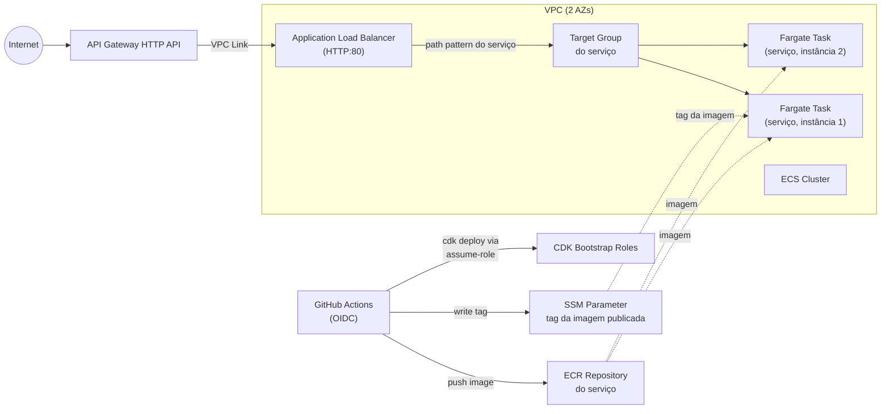

# Arquitetura de Referência — Microsserviços em ECS Fargate com API Gateway

Este documento descreve, de forma genérica, o **padrão de arquitetura** implementado por este projeto CDK (TypeScript), para que ele possa ser replicado com qualquer domínio/serviço — não apenas o exemplo concreto presente no repositório.

O repositório traz uma instância concreta desse padrão usando um serviço de exemplo chamado `products-service`; onde for útil, o texto indica esse nome apenas como ilustração do que aparece no código.

## Visão geral

O padrão provisiona uma arquitetura de microsserviços em containers rodando no **Amazon ECS (Fargate)**, exposta publicamente através de uma **API Gateway HTTP API** que se conecta, via **VPC Link**, a um **Application Load Balancer (ALB)** interno compartilhado entre serviços. O pipeline de publicação de imagens usa **ECR** com autenticação **OIDC do GitHub Actions** (sem credenciais de longa duração).

O padrão foi desenhado para suportar **múltiplos serviços** atrás do mesmo ALB e da mesma API Gateway: cada novo serviço soma um repositório ECR, uma task/service Fargate, um target group com sua própria regra de path no ALB, e uma rota na API Gateway — sem duplicar VPC, cluster, ALB ou API.

## Stacks CDK e ordem de deploy

O app define 6 stacks, com dependências explícitas:

| Ordem | Stack (papel genérico) | Depende de |
|---|---|---|
| 1 | Registro de imagens (ECR) + OIDC | — |
| 2 | Rede (VPC) | — |
| 3 | Cluster ECS | Rede |
| 4 | Serviço Fargate (uma stack por serviço) | Registro de imagens, Rede, Cluster |
| 5 | Load Balancer | Rede (registra cada serviço Fargate no listener) |
| 6 | API Gateway + VPC Link | Load Balancer, Rede |

Todas as stacks recebem tags de custo (`cost`, `team`) para rastreamento de billing — uma tag para as stacks de infraestrutura compartilhada e outra por stack de serviço, permitindo atribuir custo por microsserviço.

---

## 1. Stack de Registro de Imagens (ECR) e OIDC

- **ECR Repository** por serviço:
  - `imageTagMutability: IMMUTABLE` — tags não podem ser sobrescritas, garante rastreabilidade de deploys.
  - `emptyOnDelete: true` + `removalPolicy: DESTROY` — repositório é esvaziado e destruído junto com a stack (adequado para ambientes de estudo/dev; revisar para produção).
- **OIDC Provider do GitHub** referenciado (assume que o provider `token.actions.githubusercontent.com` já existe na conta).
- **IAM Role de push por serviço** (`github-actions-<serviço>-ecr-push`):
  - Assumida via Web Identity (OIDC), restrita por `StringLike` ao `sub` do repositório/branch do código-fonte daquele serviço — só aquele branch pode assumir essa role.
  - Recebe `grantPullPush` no repositório ECR correspondente.
  - Recebe `grantWrite` no parâmetro SSM abaixo.
- **SSM Parameter** `/{namespace}/{serviço}/image-tag`:
  - Guarda a tag da imagem publicada mais recentemente (ex.: SHA do commit).
  - É lido pela stack do serviço para montar a `ContainerImage` dinamicamente, evitando editar o CDK a cada deploy de imagem.
- **IAM Role de deploy da IaC** (`github-actions-cdk-deploy`):
  - Role separada, usada pelo workflow do repositório de IaC para rodar `cdk deploy`.
  - Restrita ao `sub` do repositório/branch da própria IaC.
  - Não recebe permissões amplas diretamente: só pode fazer `sts:AssumeRole` nas 4 roles de bootstrap do CDK (`deploy-role`, `file-publishing-role`, `image-publishing-role`, `lookup-role`) — segue o princípio de least-privilege delegando para o modelo de segurança padrão do CDK Bootstrap.

**Para replicar:** parametrize os `sub` do OIDC (repositório/branch) para cada repositório de serviço e para o repositório de IaC, e garanta que o CDK esteja "bootstrapped" (`cdk bootstrap`) na conta/região de destino.

---

## 2. Stack de Rede (VPC)

- Uma única **VPC**, `maxAzs: 2`.
- Como nenhuma configuração de subnets é passada, o CDK usa o padrão: subnets públicas + privadas (com NAT Gateway) em cada AZ. Isso significa que a stack provisiona **NAT Gateways** (custo recorrente) mesmo sem uso explícito de subnets privadas com egress no restante do código.

**Atenção ao replicar:** se o objetivo for reduzir custo, vale considerar customizar `subnetConfiguration` (ex.: eliminar NAT Gateway se as tasks Fargate não precisarem de saída para internet, usando `natGateways: 0` e VPC endpoints para ECR/CloudWatch/SSM).

---

## 3. Stack do Cluster ECS

- **ECS Cluster** único, associado à VPC criada acima, compartilhado por todos os serviços.
- `containerInsightsV2: ENABLED` — habilita Container Insights (métricas detalhadas de CPU/memória/rede por container no CloudWatch).
- Não define capacity providers customizados — como os serviços usam `FargateService` (sem EC2), o cluster funciona apenas como agrupamento lógico serverless.

---

## 4. Stack de Serviço Fargate (uma por microsserviço)

Cada serviço tem sua própria stack, seguindo o mesmo molde.

### Task Definition
- `FargateTaskDefinition`: CPU e memória definidas por serviço (no exemplo do repositório: `cpu: 512` / 0.5 vCPU, `memoryLimitMiB: 1024` / 1 GB).
- **Container** do serviço:
  - Imagem: `ContainerImage.fromEcrRepository(repository, tag)`, onde a tag vem do **SSM Parameter** de tag de imagem do serviço (lido em tempo de synth via `StringParameter.valueForStringParameter`).
  - Variáveis de ambiente típicas: `NODE_ENV=production`, `PORT=<porta do serviço>`.
  - `portMappings`: porta do serviço (centralizada em um objeto de configuração único).
  - **Logging**: CloudWatch Logs via `awslogs` driver, um log group por serviço (`/ecs/<serviço>`), retenção configurável (30 dias no exemplo), `removalPolicy: DESTROY`.

### Fargate Service
- `desiredCount` configurável por serviço (2 no exemplo, para alta disponibilidade entre AZs).
- `circuitBreaker: { enable: true, rollback: true }` — se o deploy falhar (tasks não ficam saudáveis), o ECS faz rollback automático para a versão anterior.
- `healthCheckGracePeriod` — tempo de tolerância antes de começar a matar tasks não saudáveis após o start.
- `minHealthyPercent` / `maxHealthyPercent` — controlam quantas tasks podem coexistir durante deploys rolling.
- **Security Group**: regra de ingress liberando a porta do serviço apenas para o CIDR da própria VPC — o serviço não é exposto diretamente à internet, só alcançável pelo ALB (que está na mesma VPC).
- `repository.grantPull(taskRole)` — permite que a task role puxe a imagem do ECR correspondente.

### Config compartilhada
Um objeto de configuração central mapeia, por serviço: nome, porta, path da API interna, path público, prioridade da regra do ALB e health check path. Esse objeto é consumido tanto pela stack de Load Balancer (para registrar o target group) quanto pela stack de API Gateway (para mapear o path público) — é o ponto único de verdade para "plugar" um novo serviço no restante da infraestrutura.

---

## 5. Stack de Load Balancer

- **Application Load Balancer** único, compartilhado por todos os serviços.
- **Listener** na porta 80 (HTTP), `open: true` (security group libera 0.0.0.0/0 na porta do listener).
- **Default action**: fixed response `404 Not Found` — qualquer rota não mapeada explicitamente cai aqui.
- **Método genérico de registro** (`registerFargateServiceListener` ou equivalente): registra um target group por serviço Fargate:
  - Target group dedicado, porta e protocolo do serviço.
  - `deregistrationDelay` baixo (5s no exemplo, favorece deploys rápidos).
  - Regra de roteamento por **path pattern** exclusivo do serviço, com prioridade própria.
  - Health check no path configurado do serviço.

Esse desenho permite adicionar novos microsserviços apenas chamando esse método de registro de novo com a config de cada serviço, sem criar um novo ALB.

---

## 6. Stack de API Gateway + VPC Link

- **HTTP API** (API Gateway v2) — camada pública de entrada, mais barata e simples que uma REST API tradicional, compartilhada por todos os serviços.
- **Security Group** dedicado ao VPC Link, com `allowAllOutbound: false` e egress liberado explicitamente apenas para o security group do ALB, na porta do listener — segmentação de rede restritiva.
- **VPC Link** — permite que a API Gateway (que roda fora da VPC) alcance o ALB interno via ENIs dentro da VPC.
- **Integração HTTP-ALB** (`HttpAlbIntegration`) por serviço:
  - Método HTTP, via VPC Link.
  - `ParameterMapping().overwritePath(...)` — reescreve o path público da requisição (ex.: `/produtos`) para o path interno esperado pelo ALB/serviço (ex.: `/api/produtos`), a partir da config central do serviço.
- **Rota** pública por serviço → integração correspondente.

Fluxo de uma requisição: `GET https://{api-id}.execute-api.{region}.amazonaws.com/{path-público}` → API Gateway → VPC Link → ALB (regra de path do serviço) → Target Group do serviço → task Fargate na porta interna do serviço.

---

## Segurança e rede — resumo

- Nenhum componente do plano de dados (ALB, tasks) aceita tráfego de fora da VPC além do necessário: o SG das tasks só libera a porta do serviço para o CIDR da VPC; o SG do VPC Link só tem egress para o SG do ALB.
- O ALB tem listener HTTP aberto (porta 80, `0.0.0.0/0`) — como não há Network ACL adicional restringindo, o ALB é tecnicamente alcançável da internet se for `internet-facing` (padrão do construct usado). Isso é um ponto de atenção se o requisito for "só acessível via API Gateway" — nesse caso, avaliar tornar o ALB explicitamente interno.
- Autenticação/autorização de deploy é 100% via OIDC (GitHub Actions), sem access keys estáticas.
- Tags `IMMUTABLE` no ECR + SSM Parameter como fonte de verdade da versão publicada garantem rastreabilidade determinística de qual imagem está rodando, por serviço.

## Observabilidade

- Container Insights V2 habilitado no cluster ECS (métricas de CPU/mem/rede por task).
- Logs de aplicação centralizados no CloudWatch Logs, um log group por serviço, com retenção configurável.

## Como replicar este padrão em outro contexto

1. Definir a estrutura de repositórios: um repositório de IaC (este padrão de stacks) e um repositório por serviço/domínio.
2. Na stack de ECR/OIDC, parametrizar por serviço:
   - `sub` do OIDC do repositório de IaC (`repo:<org>/<repo-iac>:ref:refs/heads/<branch>`).
   - `sub` do OIDC de cada repositório de serviço.
   - Tag inicial de imagem (ou ajustar o fluxo para tolerar ausência).
3. Criar o OIDC Provider do GitHub na conta AWS de destino, se ainda não existir (`token.actions.githubusercontent.com`), e rodar `cdk bootstrap aws://<account>/<region>`.
4. Configurar nos workflows de GitHub Actions de cada repositório as roles correspondentes: a role de deploy da IaC (para `cdk deploy`) e a role de push de imagem de cada serviço (para build/push de imagem + escrita do parâmetro SSM de tag).
5. Deploy: `npx cdk deploy --all` (respeita a ordem de dependências entre stacks).
6. **Para adicionar um novo microsserviço ao padrão**: criar uma nova stack de serviço Fargate seguindo o mesmo molde, adicionar sua entrada no objeto de configuração central, registrar seu target group na stack de Load Balancer, e adicionar sua rota correspondente na stack de API Gateway. VPC, cluster, ALB e API Gateway são reaproveitados sem alteração.

## Limitações conhecidas / débito técnico do padrão

- `removalPolicy: DESTROY` e `emptyOnDelete: true` em recursos como ECR e Log Groups indicam um padrão pensado para ambientes de estudo/dev — revisar antes de usar em produção (considerar `RETAIN` para logs e imagens).
- ALB sem `internal: true` explícito — validar se o requisito de "só acessível via API Gateway" está de fato garantido, ou tornar o ALB explicitamente interno.
- VPC usa configuração default (com NAT Gateway) — avaliar custo/necessidade real de egress das tasks para a internet.
